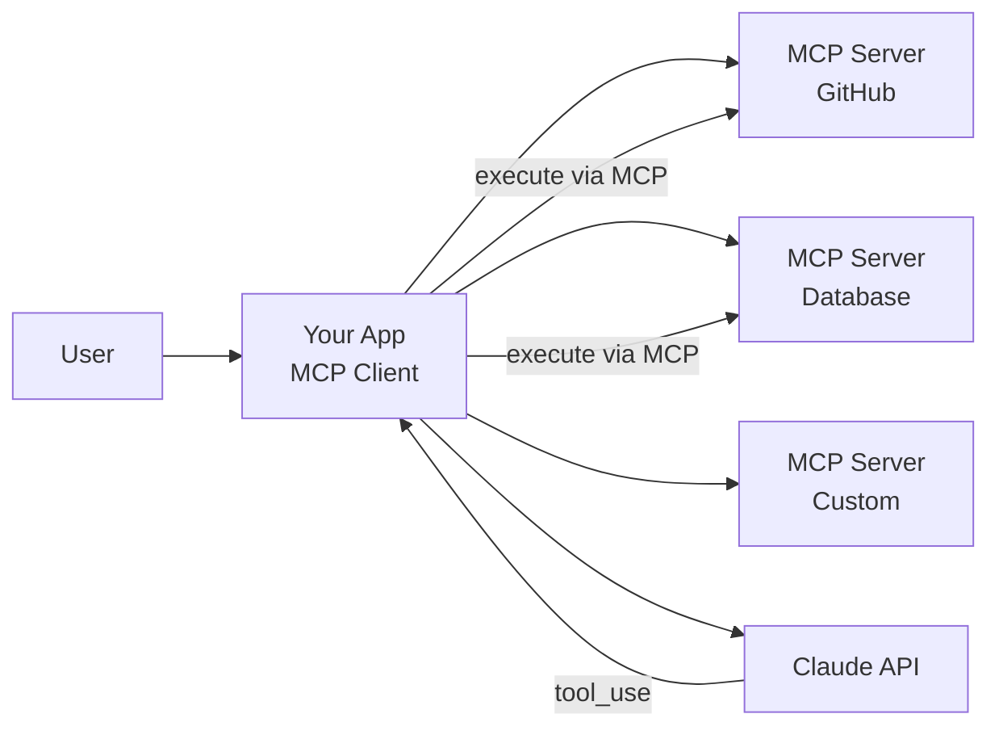

MCP (Model Context Protocol) is a standard communication layer that lets you give Claude access to external tools and data without writing integration code from scratch. Instead of defining tool schemas and execution functions yourself, you connect to MCP servers that provide them pre-built.

## Architecture

An MCP system has two sides:

- **MCP server** — wraps an external service (GitHub, a database, your internal APIs) and exposes tools, resources, and prompts through a standard protocol.
- **MCP client** — your application. It connects to MCP servers, discovers their capabilities, and uses them during Claude conversations.



MCP is **transport-agnostic** — client and server can communicate via stdio (most common for same-machine setups), HTTP, or WebSockets. The most common deployment is client and server on the same machine using stdio.

Two message types drive the tool workflow:

| Request | Response | Purpose |
| --- | --- | --- |
| `ListToolsRequest` | `ListToolsResult` | Discover available tools |
| `CallToolRequest` | `CallToolResult` | Execute a specific tool |

## Building an MCP Server

The Python SDK (`mcp`) provides `FastMCP`, a high-level class that turns Python functions into MCP-compatible tools with one decorator.

```bash
pip install mcp pydantic
```

### Defining Tools

```python
from mcp.server.fastmcp import FastMCP
from pydantic import Field

mcp = FastMCP("DocumentMCP", log_level="ERROR")

# In-memory document store for demo purposes
docs = {
    "report.pdf": "Q2 revenue grew 15% year-over-year.",
    "spec.txt": "The system shall support 10,000 concurrent connections.",
}

@mcp.tool(
    name="read_doc_contents",
    description="Read the contents of a document and return it as a string."
)
def read_document(
    doc_id: str = Field(description="Id of the document to read")
) -> str:
    if doc_id not in docs:
        raise ValueError(f"Doc with id {doc_id} not found")
    return docs[doc_id]

@mcp.tool(
    name="edit_document",
    description="Edit a document by replacing a string with a new string."
)
def edit_document(
    doc_id: str = Field(description="Id of the document to edit"),
    old_str: str = Field(description="Text to replace. Must match exactly."),
    new_str: str = Field(description="Replacement text."),
) -> str:
    if doc_id not in docs:
        raise ValueError(f"Doc with id {doc_id} not found")
    docs[doc_id] = docs[doc_id].replace(old_str, new_str)
    return f"Updated {doc_id}"
```

The `@mcp.tool` decorator auto-generates JSON schema from Python type hints. `Field(description=...)` provides the parameter descriptions that Claude reads to understand each argument. Raise `ValueError` with descriptive messages — Claude can read and recover from them.

### Defining Resources

Resources expose **read-only data** — think of them as GET endpoints. Tools perform actions; resources serve data.

```python
@mcp.resource(
    "docs://documents",
    mime_type="application/json"
)
def list_docs() -> list[str]:
    return list(docs.keys())

@mcp.resource(
    "docs://documents/{doc_id}",
    mime_type="text/plain"
)
def fetch_doc(doc_id: str) -> str:
    if doc_id not in docs:
        raise ValueError(f"Doc with id {doc_id} not found")
    return docs[doc_id]
```

Two resource types:
- **Direct** — static URI (`docs://documents`), no parameters. Use for enumerations and indexes.
- **Templated** — parameterized URI (`docs://documents/{doc_id}`). The SDK extracts `{doc_id}` from the URI and passes it as a keyword argument automatically.

Resources are efficient for injecting context into prompts without a tool call round-trip — your client fetches the resource and includes it directly in the message.

### Defining Prompts

MCP prompts are pre-built message templates that encode domain expertise. They produce better results than ad-hoc user prompts because they include specific, well-tested instructions.

```python
from mcp.server.fastmcp import base

@mcp.prompt(
    name="format",
    description="Rewrites a document's contents in Markdown format."
)
def format_document(
    doc_id: str = Field(description="Id of the document to format")
) -> list[base.Message]:
    return [
        base.UserMessage(
            f"Reformat the document with id '{doc_id}' using Markdown syntax. "
            f"Add headers, bullet points, and tables as appropriate. "
            f"Use the 'edit_document' tool to apply your changes."
        )
    ]
```

Prompt functions return `list[base.Message]` — not plain strings. Parameters are interpolated at call time via `Field` arguments.

### Running the Server

Add this to the bottom of your server file:

```python
if __name__ == "__main__":
    mcp.run()
```

## Testing with the Inspector

The MCP SDK includes a browser-based inspector for testing servers in isolation — no client or Claude connection needed.

```bash
mcp dev mcp_server.py
```

This starts a dev server on port 6277 with a browser UI where you can list and test tools, resources, and prompts individually. Use it to verify behavior before wiring up a client.

**Development workflow:** code your server, test in the inspector, iterate, then connect to your application.

## Building an MCP Client

The client connects to an MCP server and provides two core operations: discovering tools and executing them.

```python
import asyncio
import json
import anthropic
from mcp import ClientSession, StdioServerParameters
from mcp.client.stdio import stdio_client

async def run():
    # Connect to the MCP server
    server_params = StdioServerParameters(
        command="python",
        args=["mcp_server.py"],
    )

    async with stdio_client(server_params) as (read, write):
        async with ClientSession(read, write) as session:
            await session.initialize()

            # Discover tools
            tools_result = await session.list_tools()
            mcp_tools = [
                {
                    "name": tool.name,
                    "description": tool.description,
                    "input_schema": tool.inputSchema,
                }
                for tool in tools_result.tools
            ]

            # Send tools + user query to Claude
            client = anthropic.Anthropic()
            messages = [{"role": "user", "content": "What does report.pdf contain?"}]

            while True:
                response = client.messages.create(
                    model="claude-sonnet-4-20250514",
                    max_tokens=1024,
                    tools=mcp_tools,
                    messages=messages,
                )

                if response.stop_reason == "end_turn":
                    print("".join(b.text for b in response.content if b.type == "text"))
                    break

                # Execute tool calls via MCP
                messages.append({"role": "assistant", "content": response.content})
                tool_results = []
                for block in response.content:
                    if block.type == "tool_use":
                        result = await session.call_tool(block.name, block.input)
                        tool_results.append({
                            "type": "tool_result",
                            "tool_use_id": block.id,
                            "content": str(result.content[0].text)
                                if result.content else "",
                        })
                messages.append({"role": "user", "content": tool_results})

asyncio.run(run())
```

The flow: discover tools via `list_tools()`, pass them to Claude with the user query, execute any tool calls via `call_tool()`, feed results back, repeat until `stop_reason` is `"end_turn"`.

### Reading Resources from the Client

```python
from pydantic import AnyUrl

async def read_resource(session: ClientSession, uri: str):
    result = await session.read_resource(AnyUrl(uri))
    resource = result.contents[0]
    if resource.mimeType == "application/json":
        return json.loads(resource.text)
    return resource.text
```

Wrap URI strings in `AnyUrl` for the SDK. Parse the response by MIME type — `application/json` gets deserialized, `text/plain` returns as-is.

### Using Prompts from the Client

```python
async def get_available_prompts(session: ClientSession):
    result = await session.list_prompts()
    return result.prompts

async def render_prompt(session: ClientSession, name: str, args: dict[str, str]):
    result = await session.get_prompt(name, args)
    return result.messages
```

`list_prompts()` discovers available prompts. `get_prompt()` renders a prompt with arguments interpolated — the returned messages are ready to send to Claude.

:::tip
Inject resource content directly into prompts rather than having Claude fetch it via a tool call. This saves a round-trip and reduces token usage since Claude does not need to formulate and parse a tool request.
:::

:::warning
The `mcp dev` inspector UI is under active development. Screenshots in documentation may not match the current interface. Rely on the functionality, not the layout.
:::

## Quick Reference

| MCP Primitive | Decorator | Purpose | Analogy |
| --- | --- | --- | --- |
| Tool | `@mcp.tool()` | Perform actions | POST/PUT endpoint |
| Resource | `@mcp.resource()` | Expose read-only data | GET endpoint |
| Prompt | `@mcp.prompt()` | Pre-built message templates | Stored procedures |

| Client Method | Purpose |
| --- | --- |
| `session.list_tools()` | Discover available tools |
| `session.call_tool(name, input)` | Execute a tool |
| `session.read_resource(AnyUrl(uri))` | Fetch a resource |
| `session.list_prompts()` | Discover available prompts |
| `session.get_prompt(name, args)` | Render a prompt template |

## Related

- [Agent Architecture](/agents/agent-architecture) — workflows, agentic loops, and when to use each pattern
- [Tool Use](/the-api/tool-use) — the underlying tool use mechanism MCP builds on
- [Claude Code Basics](/agents/claude-code-basics) — Claude Code as an MCP client
- [Multi-Agent Systems](/agents/multi-agent-systems) — agents that coordinate via shared MCP servers
- [Anthropic docs: MCP](https://docs.anthropic.com/en/docs/build-with-claude/mcp)
- [MCP specification](https://spec.modelcontextprotocol.io/)
- [MCP Python SDK](https://github.com/modelcontextprotocol/python-sdk)
