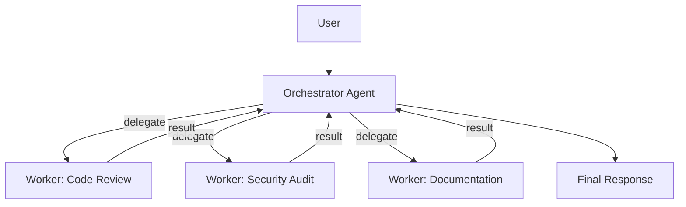
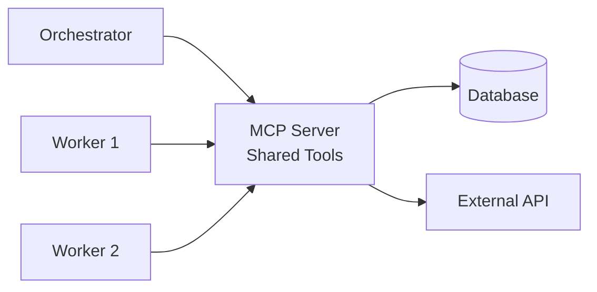
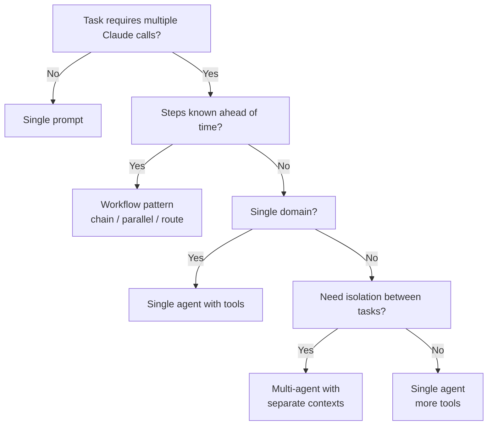

A single agent with the right tools handles most tasks. But some problems — code review pipelines, multi-domain analysis, parallel research — benefit from splitting work across multiple specialized agents. This page covers when multi-agent is worth the complexity and how to build it with both the Messages API and the managed agents API.

## When to Use Multi-Agent

Before adding agents, ask whether a simpler pattern solves the problem:

| Approach | Use when | Example |
| --- | --- | --- |
| Single prompt | Task fits one call | Summarize a document |
| Workflow (chain/parallel/route) | Steps are known ahead of time | Extract → validate → format |
| Single agent with tools | Steps are unknown but one domain | Research assistant with search + file tools |
| **Multi-agent** | Independent specializations needed, or isolation between tasks matters | Code reviewer + security auditor running in parallel |

Multi-agent adds coordination overhead, more tokens, and harder debugging. Reach for it only when a single agent's context window or tool set becomes a bottleneck, or when you need **isolation** — one agent's mistakes shouldn't pollute another's context.

## The Orchestrator Pattern

The most common multi-agent architecture is an **orchestrator** that delegates tasks to specialized worker agents. The orchestrator decides what to do; workers execute.



The orchestrator agent has a tool for each worker. When it calls a worker tool, the worker runs its own agent loop independently and returns a result.

```python
import anthropic
import json

client = anthropic.Anthropic()

def run_worker(system_prompt: str, task: str, tools: list | None = None) -> str:
    """Run a specialized worker agent and return its final response."""
    messages = [{"role": "user", "content": task}]

    for _ in range(10):  # iteration limit
        response = client.messages.create(
            model="claude-sonnet-4-20250514",
            max_tokens=2048,
            system=system_prompt,
            tools=tools or [],
            messages=messages,
        )

        if response.stop_reason == "end_turn":
            return "".join(b.text for b in response.content if b.type == "text")

        # Handle tool calls within the worker
        messages.append({"role": "assistant", "content": response.content})
        tool_results = []
        for block in response.content:
            if block.type == "tool_use":
                result = execute_tool(block.name, block.input)  # your tool logic
                tool_results.append({
                    "type": "tool_result",
                    "tool_use_id": block.id,
                    "content": result,
                })
        messages.append({"role": "user", "content": tool_results})

    return "Worker reached iteration limit."
```

The orchestrator calls workers as tools:

```python
orchestrator_tools = [
    {
        "name": "code_review",
        "description": "Run a code review on the provided code. Returns findings.",
        "input_schema": {
            "type": "object",
            "properties": {"code": {"type": "string", "description": "Code to review"}},
            "required": ["code"],
        },
    },
    {
        "name": "security_audit",
        "description": "Run a security audit on the provided code. Returns vulnerabilities found.",
        "input_schema": {
            "type": "object",
            "properties": {"code": {"type": "string", "description": "Code to audit"}},
            "required": ["code"],
        },
    },
]

WORKERS = {
    "code_review": {
        "system": "You are a senior code reviewer. Analyze the code for bugs, style issues, and performance problems. Be specific and cite line numbers.",
    },
    "security_audit": {
        "system": "You are a security auditor. Analyze the code for injection vulnerabilities, auth issues, and data exposure risks. Rate each finding as critical, high, medium, or low.",
    },
}

def execute_tool(name: str, input: dict) -> str:
    if name in WORKERS:
        return run_worker(WORKERS[name]["system"], input["code"])
    return json.dumps({"error": f"Unknown tool: {name}"})
```

Each worker has its own system prompt, context window, and (optionally) its own tools. The orchestrator sees only the worker's final output — not its internal reasoning or tool calls.

## Parallel Delegation

When workers are independent, run them concurrently to cut latency:

```python
import asyncio
import anthropic

aclient = anthropic.AsyncAnthropic()

async def run_worker_async(system_prompt: str, task: str) -> str:
    """Async version of the worker agent."""
    messages = [{"role": "user", "content": task}]

    for _ in range(10):
        response = await aclient.messages.create(
            model="claude-sonnet-4-20250514",
            max_tokens=2048,
            system=system_prompt,
            messages=messages,
        )
        if response.stop_reason == "end_turn":
            return "".join(b.text for b in response.content if b.type == "text")

        messages.append({"role": "assistant", "content": response.content})
        tool_results = []
        for block in response.content:
            if block.type == "tool_use":
                result = execute_tool(block.name, block.input)
                tool_results.append({
                    "type": "tool_result",
                    "tool_use_id": block.id,
                    "content": result,
                })
        messages.append({"role": "user", "content": tool_results})

    return "Worker reached iteration limit."

async def orchestrate(code: str) -> dict:
    """Run code review and security audit in parallel."""
    review, audit = await asyncio.gather(
        run_worker_async(
            "You are a code reviewer. Find bugs and style issues.",
            code,
        ),
        run_worker_async(
            "You are a security auditor. Find vulnerabilities.",
            code,
        ),
    )
    return {"code_review": review, "security_audit": audit}

results = asyncio.run(orchestrate("def login(user, pw): ..."))
```

## MCP-Based Tool Sharing

MCP servers let multiple agents share the same tools without duplicating definitions. Each agent connects to the same MCP server and discovers tools dynamically.



This works well for teams building agent systems: one MCP server wraps your internal APIs, and every agent — regardless of who built it — gets the same tool interface. See [MCP](/mcp/mcp) for building servers and clients.

The key advantage over hardcoded tool definitions: when you update the MCP server, every connected agent picks up the changes on the next `list_tools()` call. No code changes in any agent.

## Managed Agents API (Coordinator Topology)

The Anthropic API provides a managed multi-agent system through the coordinator topology. You define agents with the API, then configure a coordinator agent that can spawn worker agents as session threads.

```python
import anthropic

client = anthropic.Anthropic()

# Create specialized worker agents
reviewer = client.beta.agents.create(
    model="claude-sonnet-4-20250514",
    name="Code Reviewer",
    description="Reviews code for bugs, style, and performance issues.",
    system="You are a senior code reviewer. Be specific and cite line numbers.",
)

auditor = client.beta.agents.create(
    model="claude-sonnet-4-20250514",
    name="Security Auditor",
    description="Audits code for security vulnerabilities.",
    system="You are a security auditor. Rate findings as critical, high, medium, or low.",
)

# Create coordinator that can delegate to both workers
coordinator = client.beta.agents.create(
    model="claude-sonnet-4-20250514",
    name="Review Coordinator",
    description="Coordinates code review and security audit workflows.",
    system="You coordinate code reviews. Delegate code review to the Code Reviewer and security checks to the Security Auditor. Synthesize their findings into a unified report.",
    multiagent={
        "type": "coordinator",
        "agents": [
            {"type": "agent", "id": reviewer.id},
            {"type": "agent", "id": auditor.id},
        ],
    },
)
```

The coordinator topology handles session management, message routing, and result aggregation on the server side. Key constraints:

- **Depth limit of 1**: worker agents cannot themselves have a `multiagent` configuration (no recursive orchestration).
- **1-20 agents** in the roster.
- **Self-reference** is supported — a coordinator can spawn a copy of itself for recursive tasks using `{"type": "self"}` in the roster.
- Worker agents must exist and must not be archived.

:::tip
Start with the manual orchestrator pattern (plain Messages API + tool calls) to prototype. Move to the managed agents API when you need persistent agent configurations, session management, or server-side coordination.
:::

## Subagents in Claude Code

Claude Code has built-in multi-agent support through **subagents** — isolated execution contexts that receive a task, work independently, and return results.

Subagents are defined in `.claude/agents/` with frontmatter that specifies their tools and skills:

```markdown
---
name: security-reviewer
description: Reviews code changes for security vulnerabilities
tools: Bash, Read, Glob, Grep, Skill
skills: security-audit
---

Review the provided code for security vulnerabilities.
Focus on injection attacks, authentication issues, and data exposure.
```

Key behaviors:
- Subagents start with a **fresh context** — they do not inherit the parent conversation's history or skills
- Skills must be explicitly listed in the subagent's frontmatter `skills` field
- Built-in agents (Explorer, Plan, Verify) cannot use skills — only custom subagents support the `skills` field
- The Claude Code SDK (`@anthropic-ai/claude-agent-sdk`) enables launching subagents programmatically from hooks or scripts

The AI-reviews-AI pattern — where a hook launches a separate Claude instance to review the first Claude's work — runs inside your development workflow.

:::warning
Subagents do not inherit skills from the parent conversation. If your worker needs a skill, you must list it in the agent's frontmatter. This catches most people off guard.
:::

## Architecture Decision Guide



## Quick Reference

| Pattern | Isolation | Shared state | Complexity | Best for |
| --- | --- | --- | --- | --- |
| Orchestrator + workers (manual) | Full — separate message histories | Via tool results only | Medium | Custom pipelines, prototyping |
| Coordinator topology (managed API) | Full — server-managed sessions | Via coordinator | Medium | Persistent agent configs, production |
| Claude Code subagents | Full — fresh context per subagent | Via file system | Low | Development workflows, CI/CD |
| Single agent, many tools | None — shared context | Full conversation history | Low | Most tasks |

## Related

- [Agent Architecture](/agents/agent-architecture) — workflows vs agents, orchestration patterns
- [MCP (Model Context Protocol)](/mcp/mcp) — building MCP servers for shared tool access
- [Claude Code Skills](/claude-code/skills) — skills and subagent configuration
- [Claude Code Hooks](/claude-code/hooks) — event-driven automation including AI-reviews-AI
- [Cost Optimization](/production/cost-optimization) — managing costs in multi-agent systems
- [Anthropic docs: Building effective agents](https://docs.anthropic.com/en/docs/build-with-claude/agentic-systems)
- [Anthropic docs: Agents API](https://docs.anthropic.com/en/docs/build-with-claude/agents)
