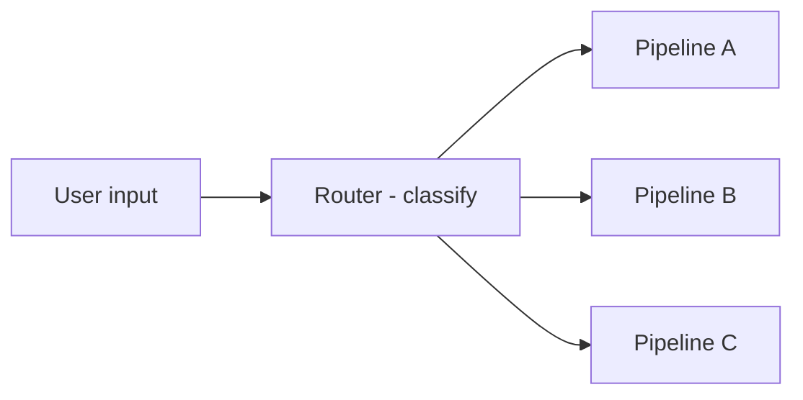
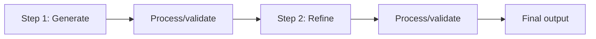
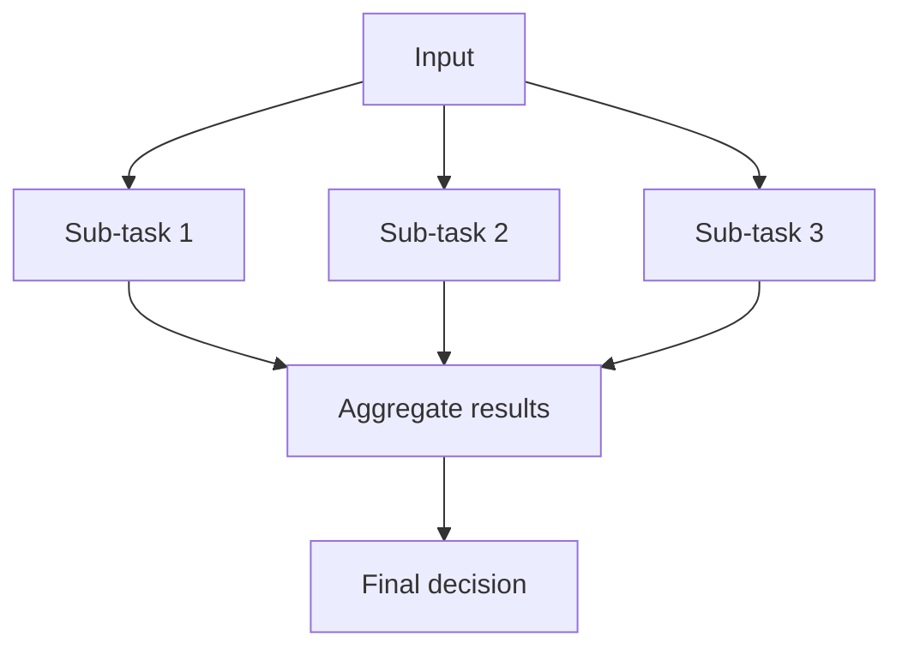

A single generic prompt rarely handles diverse inputs well. Classification and routing split incoming requests by type, then hand each type to a specialized handler. This page covers three orchestration patterns that make this work: routing, chaining, and parallelization.

## Routing: Classify Then Specialize

Routing is a two-step pattern: an initial Claude call classifies the input, then your code routes it to a specialized pipeline based on that classification.



Each pipeline gets its own prompt, tools, and context tuned for its category. The user's input goes to exactly one pipeline.

```python
import anthropic

client = anthropic.Anthropic()

CATEGORIES = ["technical", "billing", "general"]

def classify(user_message: str) -> str:
    """Classify a user message into a support category."""
    response = client.messages.create(
        model="claude-sonnet-4-20250514",
        max_tokens=50,
        messages=[{
            "role": "user",
            "content": f"""Classify this support request into exactly one category.

<categories>
{chr(10).join(f"- {c}" for c in CATEGORIES)}
</categories>

<request>{user_message}</request>

Respond with the category name only."""
        }]
    )
    return response.content[0].text.strip().lower()

def route(user_message: str) -> str:
    """Route a message to the appropriate specialized handler."""
    category = classify(user_message)

    handlers = {
        "technical": handle_technical,
        "billing": handle_billing,
        "general": handle_general,
    }

    handler = handlers.get(category, handle_general)
    return handler(user_message)
```

Each handler has its own system prompt and tools:

```python
def handle_technical(message: str) -> str:
    """Handle technical support with access to docs and diagnostics."""
    response = client.messages.create(
        model="claude-sonnet-4-20250514",
        max_tokens=1024,
        system="""You are a technical support specialist. Provide precise,
actionable solutions. Include code snippets when relevant. Reference
documentation links.""",
        messages=[{"role": "user", "content": message}]
    )
    return response.content[0].text

def handle_billing(message: str) -> str:
    """Handle billing inquiries with a careful, policy-aware tone."""
    response = client.messages.create(
        model="claude-sonnet-4-20250514",
        max_tokens=1024,
        system="""You are a billing support specialist. Be empathetic and precise
about pricing, refunds, and account changes. Always reference the specific
policy that applies.""",
        messages=[{"role": "user", "content": message}]
    )
    return response.content[0].text

def handle_general(message: str) -> str:
    """Handle general inquiries."""
    response = client.messages.create(
        model="claude-sonnet-4-20250514",
        max_tokens=1024,
        messages=[{"role": "user", "content": message}]
    )
    return response.content[0].text

# Usage
response = route("My API key returns a 401 error when I try to authenticate")
print(response)
```

:::tip
Use [structured output](/prompting/structured-output) for the classification step. Returning a constrained category name (not free-form text) eliminates parsing errors in the routing logic.
:::

### When to Route

Routing works best when:
- Different request types need fundamentally different handling
- Response quality improves significantly with specialized context
- Categories are reliably distinguishable by Claude

Routing adds one extra API call for classification. Use it when the quality improvement from specialization outweighs that cost.

## Chaining: Sequential Steps

Chaining breaks a complex task into smaller sequential steps where each step's output feeds the next. Unlike routing (which fans out), chaining is linear.



The key benefit: each step focuses on one task. Claude handles a single, clear instruction better than a prompt loaded with many competing constraints.

```python
import anthropic

client = anthropic.Anthropic()

def generate_draft(topic: str) -> str:
    """Step 1: Generate initial content."""
    response = client.messages.create(
        model="claude-sonnet-4-20250514",
        max_tokens=2048,
        messages=[{
            "role": "user",
            "content": f"Write a technical blog post about {topic}. "
                       f"Focus on practical examples and clear explanations."
        }]
    )
    return response.content[0].text

def revise_for_constraints(draft: str) -> str:
    """Step 2: Fix constraint violations in the draft."""
    response = client.messages.create(
        model="claude-sonnet-4-20250514",
        max_tokens=2048,
        messages=[{
            "role": "user",
            "content": f"""Revise the article below. Follow these steps:
1. Remove any text that identifies the author as an AI
2. Remove all emojis
3. Replace any informal or clichéd writing with precise technical language
4. Ensure all code examples include necessary imports

<article>
{draft}
</article>

Output the revised article only."""
        }]
    )
    return response.content[0].text

# Chain the steps
draft = generate_draft("async Python patterns")
final = revise_for_constraints(draft)
print(final)
```

### The Long-Prompt Problem

When a prompt includes many constraints, Claude will often violate some of them -- even when clearly stated. This is a known failure mode, not a one-off bug.

The two-step solution: generate first (accepting some violations), then pass the output to a dedicated revision prompt that focuses solely on checking and fixing those violations. This consistently outperforms trying to get everything right in a single call.

### Non-LLM Steps in the Chain

Chains can include programmatic processing between Claude calls:

```python
import json

def content_pipeline(topic: str) -> dict:
    """Multi-step pipeline mixing Claude and code."""
    # Step 1: Claude generates structured outline
    outline = generate_outline(topic)

    # Step 2: Code validates and transforms
    parsed = json.loads(outline)
    sections = [s for s in parsed["sections"] if s["word_count"] > 100]

    # Step 3: Claude expands each section
    expanded = [expand_section(s) for s in sections]

    # Step 4: Code assembles final document
    return {"topic": topic, "sections": expanded}
```

## Parallelization: Independent Sub-Tasks

Parallelization splits a task into independent sub-tasks, runs them simultaneously, then aggregates the results. Use it when a single prompt would divide Claude's attention across too many criteria.



```python
import asyncio
import anthropic

async_client = anthropic.AsyncAnthropic()

async def analyze_dimension(text: str, dimension: str, criteria: str) -> dict:
    """Analyze text along a single dimension."""
    response = await async_client.messages.create(
        model="claude-sonnet-4-20250514",
        max_tokens=512,
        messages=[{
            "role": "user",
            "content": f"""Evaluate this text for {dimension}.

<criteria>{criteria}</criteria>
<text>{text}</text>

Respond with JSON: {{"dimension": "{dimension}", "score": 1-10, "analysis": "brief explanation"}}"""
        }]
    )
    import json
    return json.loads(response.content[0].text)

async def parallel_review(text: str) -> dict:
    """Review text across multiple dimensions in parallel."""
    dimensions = {
        "clarity": "Is the writing clear and easy to follow?",
        "accuracy": "Are all technical claims correct and well-supported?",
        "completeness": "Does it cover all relevant aspects of the topic?",
    }

    tasks = [
        analyze_dimension(text, dim, criteria)
        for dim, criteria in dimensions.items()
    ]
    results = await asyncio.gather(*tasks)

    # Aggregate
    avg_score = sum(r["score"] for r in results) / len(results)
    return {
        "overall_score": avg_score,
        "dimensions": results
    }

# Usage
import asyncio
result = asyncio.run(parallel_review("Your text to review here..."))
print(f"Overall: {result['overall_score']:.1f}/10")
for dim in result["dimensions"]:
    print(f"  {dim['dimension']}: {dim['score']}/10 - {dim['analysis']}")
```

Each parallel branch gets specialized context rather than a single prompt that tries to evaluate everything at once. New dimensions can be added without modifying existing branches.

:::warning
Each parallel call has its own latency and token cost. Parallelization improves quality and throughput, but increases total API spend linearly with the number of branches.
:::

## Choosing a Pattern

| Pattern | Structure | Best for | Trade-off |
| --- | --- | --- | --- |
| Routing | Fan-out to one handler | Diverse input types needing specialized handling | Extra classification call |
| Chaining | Sequential steps | Complex tasks with multiple constraints | Added latency (sequential) |
| Parallelization | Fan-out to all, aggregate | Multi-criteria evaluation or analysis | Higher total API cost |

These patterns compose. A routing step can send inputs to different chains, each of which may use parallelization internally. Start with the simplest pattern that meets your quality bar, then add complexity only where the scores justify it.

## Related

- [Tool Use](/the-api/tool-use) --- give specialized handlers access to external tools
- [Structured Output](/prompting/structured-output) --- enforce clean classifier output for routing
- [System Prompts](/prompting/system-prompts) --- tune each handler with role-specific context
- [Evaluation & Testing](/prompting/evaluation) --- measure whether routing improves response quality
- [Agent Architecture](/agents/agent-architecture) --- when to use agents vs. orchestrated workflows
- [Anthropic docs: Prompt engineering](https://docs.anthropic.com/en/docs/build-with-claude/prompt-engineering)
