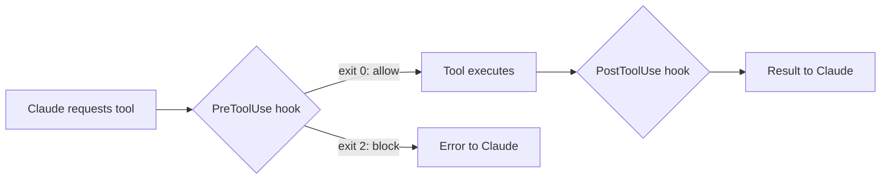

Hooks let you run commands before or after Claude Code executes a tool — intercepting the tool pipeline to enforce rules, automate quality checks, and integrate with external systems. Combined with GitHub Actions integration, hooks turn Claude Code from an interactive assistant into an automated development workflow.

## How Hooks Work

Claude Code's normal flow: your prompt goes to Claude, Claude requests a tool call (Read, Write, Bash, etc.), Claude Code executes it, and the result goes back to Claude. Hooks insert before or after that execution step.



**PreToolUse hooks** run before a tool call. They can allow it (exit code 0) or block it (exit code 2). Anything written to stderr becomes the error message Claude sees.

**PostToolUse hooks** run after a tool call completes. They can run follow-up operations and provide feedback, but cannot block — the tool already ran.

## Defining a Hook

Hook configuration lives in Claude settings files, with the same three-scope hierarchy as CLAUDE.md:

| File | Scope |
| --- | --- |
| `~/.claude/settings.json` | Global (all projects) |
| `.claude/settings.json` | Project (shared with team) |
| `.claude/settings.local.json` | Project (personal) |

Each hook has a `matcher` that targets specific tool types and a `command` that runs when matched:

```json
{
  "hooks": {
    "PreToolUse": [
      {
        "matcher": "Read",
        "hooks": [
          {
            "type": "command",
            "command": "node ${CLAUDE_PROJECT_DIR}/hooks/guard-env.js"
          }
        ]
      }
    ],
    "PostToolUse": [
      {
        "matcher": "Write|Edit",
        "hooks": [
          {
            "type": "command",
            "command": "prettier --write ${CLAUDE_PROJECT_DIR}/src/**/*.ts"
          }
        ]
      }
    ]
  }
}
```

Use pipe-separated values in `matcher` to target multiple tools (e.g., `"Write|Edit"`). You can also configure hooks interactively with the `/hooks` command inside Claude Code.

## Implementing a Hook: Blocking .env Access

Hook commands receive a JSON object via stdin with details about the tool call. Here is a complete PreToolUse hook that blocks Claude from reading `.env` files:

```javascript
// hooks/guard-env.js
process.stdin.setEncoding("utf8");
let input = "";
process.stdin.on("data", (d) => (input += d));
process.stdin.on("end", () => {
  const toolArgs = JSON.parse(input);
  const readPath = toolArgs.tool_input?.file_path || "";
  if (readPath.includes(".env")) {
    console.error("Blocked: cannot read .env files");
    process.exit(2); // Block the tool call
  }
  process.exit(0); // Allow the tool call
});
```

The JSON input your hook receives looks like this:

```json
{
  "session_id": "2d6a1e4d-6...",
  "transcript_path": "/Users/you/.claude/sessions/...",
  "hook_event_name": "PreToolUse",
  "tool_name": "Read",
  "tool_input": {
    "file_path": "/code/project/.env"
  }
}
```

Register it in `.claude/settings.local.json`:

```json
{
  "hooks": {
    "PreToolUse": [
      {
        "matcher": "Read",
        "hooks": [
          { "type": "command", "command": "node $PWD/hooks/guard-env.js" }
        ]
      }
    ]
  }
}
```

:::warning
Each tool type has a different input shape. The `Read` tool sends `{"file_path": "..."}`, `Grep` sends `{"pattern": "...", "path": "..."}`, and `Bash` sends `{"command": "..."}`. A file_path check on Read will not catch `grep API_KEY .` or `cat .env` via Bash. For comprehensive file protection, combine hooks with `permissions.deny` rules: `"Read(**/.env)"`.
:::

## Practical Hook Patterns

### Auto-Format on Save

Run Prettier (or any formatter) after every file write:

```json
{
  "hooks": {
    "PostToolUse": [
      {
        "matcher": "Write|Edit",
        "hooks": [
          {
            "type": "command",
            "command": "prettier --write ${CLAUDE_PROJECT_DIR}/src/**/*.{ts,tsx}"
          }
        ]
      }
    ]
  }
}
```

### Type Checking After Edits

Catch type errors immediately — Claude receives compiler output and self-corrects:

```json
{
  "hooks": {
    "PostToolUse": [
      {
        "matcher": "Write|Edit",
        "hooks": [
          {
            "type": "command",
            "command": "tsc --noEmit 2>&1 || true"
          }
        ]
      }
    ]
  }
}
```

This is particularly effective when Claude updates a function signature but misses call sites in other files. The type errors feed back into Claude's context, prompting it to fix the remaining references.

### AI-Reviews-AI

Use the Claude Code Agent SDK in a PostToolUse hook to launch a second Claude instance that reviews the first Claude's work:

```javascript
// hooks/review-queries.js — conceptual pattern
import { query } from "@anthropic-ai/claude-agent-sdk";

// Read the file that was just written
// Launch a second Claude to review it for duplicate functionality
// Feed findings back to the original Claude via stdout
```

This pattern is powerful for critical directories (query files, API definitions) but adds latency and API cost. Scope it narrowly — only monitor high-value directories.

:::tip
Start with lightweight hooks (formatting, linting) before adding heavier ones (separate Claude instances). Every hook adds latency to tool calls.
:::

## GitHub Actions Integration

Claude Code has an official GitHub integration that runs Claude inside GitHub Actions for automated PR reviews and issue handling.

### Setup

```bash
# Inside Claude Code
> /install-github-app
```

This installs the GitHub app, adds your API key, and auto-generates a PR with workflow files in `.github/workflows/`. Two workflows are included:

1. **Mention support** — `@claude` in any issue or PR triggers Claude to work on it
2. **Automatic PR reviews** — Claude reviews and posts a report on every new PR

### Customizing Workflows

Add project setup steps and context to your workflow files:

```yaml
- name: Project Setup
  run: |
    npm run setup
    npm run dev:daemon

# Tell Claude what's already running
custom_instructions: |
  The project is already set up with all dependencies installed.
  The server is running at localhost:3000.
  Use mcp__playwright tools to interact with the app in a browser.
```

### MCP Servers in CI/CD

Configure MCP servers for GitHub Actions runs to give Claude browser or database access:

```yaml
mcp_config: |
  {
    "mcpServers": {
      "playwright": {
        "command": "npx",
        "args": [
          "@playwright/mcp@latest",
          "--allowed-origins",
          "localhost:3000"
        ]
      }
    }
  }
```

### Tool Permissions in Actions

In GitHub Actions, every allowed tool must be explicitly listed — no bulk approval:

```yaml
allowed_tools: "Bash(npm:*),Bash(sqlite3:*),mcp__playwright__browser_snapshot,mcp__playwright__browser_click"
```

MCP tool identifiers use double underscores (`mcp__playwright__browser_snapshot`), not single.

:::warning
The `allowed_tools` requirement in GitHub Actions is stricter than local development. Each tool from each MCP server must be individually listed. Test workflows with simple tasks before adding complex tool permissions.
:::

## Quick Reference

| Hook Type | When It Runs | Can Block? | Use For |
| --- | --- | --- | --- |
| `PreToolUse` | Before tool execution | Yes (exit 2) | Access control, validation, safety gates |
| `PostToolUse` | After tool execution | No | Formatting, testing, logging, feedback |

| Exit Code | Meaning |
| --- | --- |
| `0` | Allow the tool call |
| `2` | Block the tool call (PreToolUse only) |

## Related

- [Claude Code: Basics & Context](/claude-code/basics) — CLAUDE.md setup and context management
- [Claude Code: Skills & SDK](/claude-code/skills) — reusable instructions and programmatic control
- [Agent Architecture](/agents/agent-architecture) — the agent loop that hooks intercept
- [Safety](/production/safety) — broader safety patterns for production systems
- [Error Handling](/production/error-handling) — handling failures in automated pipelines
- [Anthropic Claude Code hooks guide](https://docs.anthropic.com/en/docs/claude-code/hooks) — official reference
