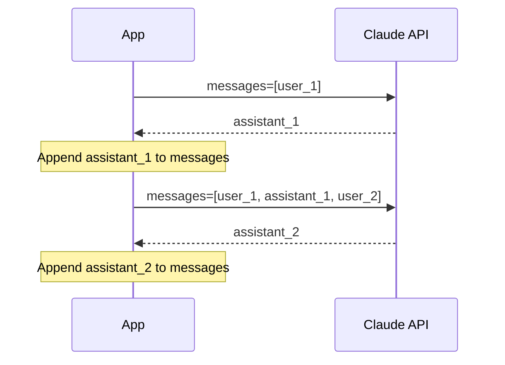

# {frontmatter.title}

Every interaction with Claude goes through the Messages API. You send a list of messages, Claude sends back a response. This page covers the request structure, the response object, and how to build multi-turn conversations on top of a stateless API.

## Making Your First Request

Install the SDK and set your API key:

```bash
pip install anthropic
```

```bash
export ANTHROPIC_API_KEY="your-api-key-here"
```

The SDK reads `ANTHROPIC_API_KEY` from the environment automatically. A minimal request needs three parameters: `model`, `max_tokens`, and `messages`.

```python
from anthropic import Anthropic

client = Anthropic()

message = client.messages.create(
    model="claude-sonnet-4-20250514",
    max_tokens=1024,
    messages=[
        {"role": "user", "content": "What is quantum computing? One sentence."}
    ]
)

print(message.content[0].text)
```

The same request in TypeScript:

```typescript
import Anthropic from "@anthropic-ai/sdk";

const client = new Anthropic();

const message = await client.messages.create({
  model: "claude-sonnet-4-20250514",
  max_tokens: 1024,
  messages: [
    { role: "user", content: "What is quantum computing? One sentence." }
  ]
});

console.log(message.content[0].text);
```

:::warning
Never expose your API key in client-side code. All requests to the Anthropic API must go through a server you control. Store the key in an environment variable or a secrets manager.
:::

## Request Parameters

| Parameter | Type | Required | Description |
| --- | --- | --- | --- |
| `model` | string | Yes | Model identifier, e.g. `"claude-sonnet-4-20250514"` |
| `max_tokens` | integer | Yes | Hard ceiling on output tokens. Claude stops if it hits this limit. |
| `messages` | array | Yes | Alternating `user` and `assistant` message objects |
| `system` | string or array | No | [System prompt](/foundations/system-prompts) — instructions separate from the conversation |
| `stop_sequences` | array of strings | No | Custom strings that halt generation. See [structured output](/foundations/structured-output). |
| `stream` | boolean | No | Enable [streaming](/foundations/streaming). Default `false`. |

Each message in the `messages` array has two fields: `role` (either `"user"` or `"assistant"`) and `content` (a string or array of content blocks for [multimodal input](/foundations/multimodal-input)).

:::tip
`max_tokens` is a safety ceiling, not a target. Claude generates what it deems appropriate and stops — it does not try to fill the limit. Set it high enough that responses won't be cut off, but don't worry about it inflating output.
:::

## The Response Object

```python
print(message.model_dump_json(indent=2))
```

```json
{
  "id": "msg_01XFDUDYJgAACzvnptvVoYEL",
  "type": "message",
  "role": "assistant",
  "content": [
    {
      "type": "text",
      "text": "Quantum computing uses quantum-mechanical phenomena..."
    }
  ],
  "stop_reason": "end_turn",
  "usage": {
    "input_tokens": 18,
    "output_tokens": 32
  }
}
```

Key fields:

- **`content`** — A list of content blocks. For text responses, access the text at `message.content[0].text`.
- **`stop_reason`** — Why generation stopped: `end_turn` (natural finish), `max_tokens` (hit the ceiling), `stop_sequence` (matched a custom stop string), or `tool_use` (invoked a [tool](/patterns/tool-use)).
- **`usage`** — Token counts for billing and [cost optimization](/production/cost-optimization). `input_tokens` + `output_tokens` = total tokens consumed.

Handle `stop_reason` in your application logic. If you see `max_tokens`, the response was likely truncated.

## Multi-Turn Conversations

Claude is stateless. It stores nothing between API calls. To maintain a conversation, you accumulate the full message history and send it with every request.

```python
from anthropic import Anthropic

client = Anthropic()

conversation = []

def chat(user_input: str) -> str:
    conversation.append({"role": "user", "content": user_input})

    response = client.messages.create(
        model="claude-sonnet-4-20250514",
        max_tokens=1024,
        messages=conversation,
    )

    assistant_text = response.content[0].text
    conversation.append({"role": "assistant", "content": assistant_text})
    return assistant_text

# Turn 1
print(chat("Define quantum computing in one sentence."))

# Turn 2 — Claude has context from turn 1
print(chat("Now explain it to a five-year-old."))
```

The pattern: append the user message, call the API with the full list, append Claude's response, repeat.



:::warning
Forgetting to append Claude's response before the next request is the most common multi-turn bug. Without the prior assistant message in the list, Claude has zero context for follow-up references like "explain that further."
:::

## Context Window Limits

Message history grows with every turn. Eventually it approaches the model's context window limit. Strategies for managing this:

- **Truncate old messages** — Drop the earliest turns while keeping the system prompt and recent context.
- **Summarize** — Periodically ask Claude to summarize the conversation so far, then replace older messages with the summary.
- **Sliding window** — Keep only the last N turns.

For details on model context sizes, see [Models & Parameters](/foundations/models-and-parameters).

## Quick Reference

```python
from anthropic import Anthropic

client = Anthropic()

# Single turn
message = client.messages.create(
    model="claude-sonnet-4-20250514",
    max_tokens=1024,
    messages=[{"role": "user", "content": "Your prompt here"}],
)

# Access response
text = message.content[0].text
tokens_used = message.usage.input_tokens + message.usage.output_tokens
stopped_because = message.stop_reason
```

## Related

- [Models & Parameters](/foundations/models-and-parameters) — choosing the right model and tuning output
- [System Prompts & Prompt Design](/foundations/system-prompts) — shaping Claude's behavior
- [Streaming](/foundations/streaming) — real-time progressive responses
- [Structured Output](/foundations/structured-output) — getting JSON from Claude
- [Anthropic Messages API reference](https://docs.anthropic.com/en/api/messages)
- [Anthropic Python SDK](https://github.com/anthropics/anthropic-sdk-python)
- [Anthropic TypeScript SDK](https://github.com/anthropics/anthropic-sdk-typescript)
