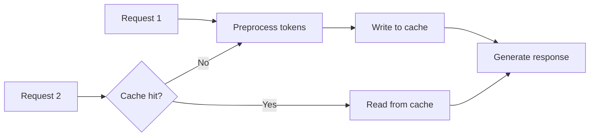

Claude charges per token — input and output. On high-volume applications, costs add up fast. Prompt caching, batch processing, and smart request design can cut your bill by 50-90%. This page covers the mechanics and when each strategy pays off.

## How Prompt Caching Works

Every API request triggers preprocessing: tokenization, embedding, context analysis. Without caching, Claude discards all that work after responding. On the next request with the same content, it repeats everything.

Prompt caching saves the preprocessing results so subsequent requests with identical content skip directly to generation.



Cache hits reduce input token costs by 90% and deliver faster time-to-first-token. The tradeoff: cache writes cost 25% more than standard input tokens. Break-even happens on the second request.

| Token type | Cost relative to base input |
| --- | --- |
| Standard input | 1x |
| Cache write | 1.25x |
| Cache read (hit) | 0.1x |

## Cache Control Breakpoints

Caching is not automatic. You add `cache_control` markers to specific content blocks, telling Claude what to cache.

```python
from anthropic import Anthropic

client = Anthropic()

response = client.messages.create(
    model="claude-sonnet-4-20250514",
    max_tokens=1024,
    system=[
        {
            "type": "text",
            "text": "You are a legal document analyst. Always cite specific sections...",
            "cache_control": {"type": "ephemeral"}
        }
    ],
    messages=[
        {"role": "user", "content": "Summarize the key obligations in Section 3."}
    ]
)

print(response.usage)
# Look for cache_creation_input_tokens (write) or cache_read_input_tokens (hit)
```

The `cache_control: {"type": "ephemeral"}` marker is a breakpoint. It tells Claude to cache everything up to and including that block. Content after the breakpoint is processed normally.

### Rules You Need to Know

- **Maximum 4 breakpoints per request.** Place them strategically.
- **Minimum 1024 tokens** of content must be cached. Short system prompts below this threshold won't cache.
- **Byte-for-byte match required.** Even adding a space invalidates the cache.
- **Cache TTL is 5 minutes**, refreshed on each hit. Inactive caches expire.
- **Processing order matters:** Claude processes tools first, then system prompt, then messages. A breakpoint in messages caches everything before it, including tools and system prompt.

:::warning
You must use the expanded block format (object with `type`, `text`, `cache_control`) — not a plain string. A system prompt passed as `system="You are..."` cannot carry a cache breakpoint.
:::

## Caching Tool Definitions

Tool schemas are caching candidates — they rarely change between requests and can be large.

```python
tools = [
    {
        "name": "search_documents",
        "description": "Search the document corpus",
        "input_schema": {
            "type": "object",
            "properties": {
                "query": {"type": "string"},
                "max_results": {"type": "integer"}
            },
            "required": ["query"]
        }
    },
    {
        "name": "get_document",
        "description": "Retrieve a specific document by ID",
        "input_schema": {
            "type": "object",
            "properties": {
                "document_id": {"type": "string"}
            },
            "required": ["document_id"]
        }
    }
]

# Cache all tools by adding breakpoint to the last one
tools_with_cache = tools.copy()
last_tool = tools_with_cache[-1].copy()
last_tool["cache_control"] = {"type": "ephemeral"}
tools_with_cache[-1] = last_tool

response = client.messages.create(
    model="claude-sonnet-4-20250514",
    max_tokens=1024,
    tools=tools_with_cache,
    messages=[{"role": "user", "content": "Find documents about API rate limits"}]
)
```

A breakpoint on the last tool caches all preceding tools. Always copy the list and the last tool before adding `cache_control` — mutating the original causes bugs when tools are reordered.

## Verifying Cache Effectiveness

Check the `usage` object in every response:

```python
usage = response.usage
print(f"Input tokens: {usage.input_tokens}")
print(f"Cache write:  {usage.cache_creation_input_tokens}")
print(f"Cache read:   {usage.cache_read_input_tokens}")
```

- **First request:** `cache_creation_input_tokens` > 0, `cache_read_input_tokens` = 0
- **Subsequent requests:** `cache_creation_input_tokens` = 0, `cache_read_input_tokens` > 0
- **Partial hits possible:** If tools are cached but you changed the system prompt, you'll see a read for tools and a write for the new system prompt.

:::tip
Log these metrics in production. If `cache_read_input_tokens` stays at 0, something is invalidating your cache — check for content drift between requests.
:::

## Batch API

For workloads that don't need real-time responses, the Message Batches API processes requests asynchronously at 50% of standard pricing.

```python
from anthropic import Anthropic

client = Anthropic()

batch = client.messages.batches.create(
    requests=[
        {
            "custom_id": "eval-001",
            "params": {
                "model": "claude-sonnet-4-20250514",
                "max_tokens": 1024,
                "messages": [
                    {"role": "user", "content": "Classify this ticket: My login is broken"}
                ]
            }
        },
        {
            "custom_id": "eval-002",
            "params": {
                "model": "claude-sonnet-4-20250514",
                "max_tokens": 1024,
                "messages": [
                    {"role": "user", "content": "Classify this ticket: Feature request for dark mode"}
                ]
            }
        }
    ]
)

print(f"Batch ID: {batch.id}")
print(f"Status: {batch.processing_status}")
```

Batch processing returns results within 24 hours (often faster). Use it for evaluations, bulk classification, data extraction, and any non-interactive workload.

## Token Efficiency Strategies

Beyond caching and batching, reduce costs by sending fewer tokens:

| Strategy | Impact | When to use |
| --- | --- | --- |
| Shorter system prompts | Lower input cost per request | Always — trim to essentials |
| Token counting before send | Avoid wasted requests | Large or variable inputs |
| `max_tokens` tuning | Prevents runaway output | Classification, short-answer tasks |
| Model selection | Haiku is ~10x cheaper than Opus | Simple tasks that don't need top-tier reasoning |
| Structured output | Shorter, parseable responses | Data extraction, classification |

Pre-count tokens to catch requests that would exceed context limits:

```python
count = client.messages.count_tokens(
    model="claude-sonnet-4-20250514",
    messages=[{"role": "user", "content": large_document}]
)

print(f"Input tokens: {count.input_tokens}")
```

## Quick Reference

| Feature | Cost impact | Best for |
| --- | --- | --- |
| Prompt caching (read) | 90% savings on cached input | Repeated system prompts, tool schemas, document analysis |
| Prompt caching (write) | 25% premium on first request | — (cost of enabling caching) |
| Batch API | 50% savings on all tokens | Non-interactive bulk workloads |
| Haiku over Sonnet | ~75% savings | Simple classification, extraction |
| Haiku over Opus | ~95% savings | High-volume low-complexity tasks |

## Related

- [Messages API](/the-api/messages-api) — request structure and the usage object
- [Models & Parameters](/the-api/models-and-parameters) — model pricing tiers and capabilities
- [Tool Use](/the-api/tool-use) — building tool schemas that work with caching
- [Rate Limits & Scaling](/production/rate-limits) — throughput management
- [Anthropic prompt caching docs](https://docs.anthropic.com/en/docs/build-with-claude/prompt-caching)
- [Anthropic Message Batches API](https://docs.anthropic.com/en/docs/build-with-claude/message-batches)
