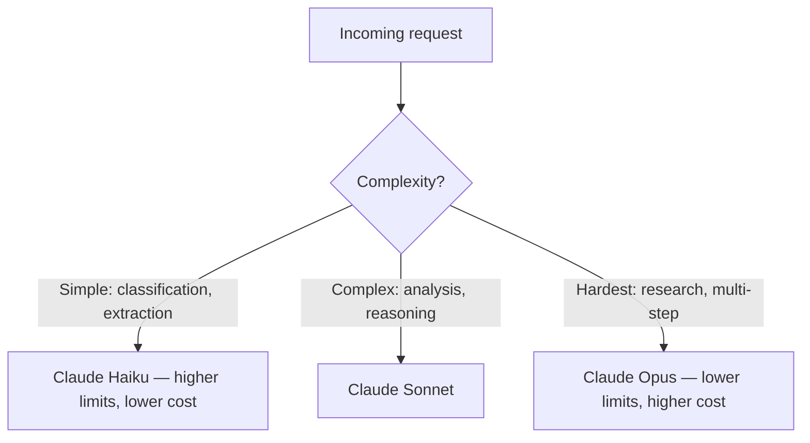

Anthropic enforces rate limits to ensure fair access and platform stability. You hit three types of limits: requests per minute (RPM), input tokens per minute (ITPM), and output tokens per minute (OTPM). Understanding these limits — and designing around them — prevents a flood of 429 errors.

## Rate Limit Types

| Limit | What it measures | Typical bottleneck |
| --- | --- | --- |
| RPM (Requests per minute) | Number of API calls | High-volume, short-prompt workloads |
| ITPM (Input tokens per minute) | Total input tokens across all requests | Large context / RAG applications |
| OTPM (Output tokens per minute) | Total output tokens across all requests | Long-form generation tasks |

All three are enforced simultaneously. Hitting any one triggers a 429 error, even if the other two are well within limits.

## Usage Tiers

Anthropic uses a tier system based on your account's usage history and spend. Higher tiers unlock higher limits:

| Tier | RPM | ITPM | OTPM | How to reach |
| --- | --- | --- | --- | --- |
| Tier 1 (Free/Trial) | 50 | 40,000 | 8,000 | Default |
| Tier 2 | 1,000 | 400,000 | 80,000 | $40+ spend |
| Tier 3 | 2,000 | 800,000 | 160,000 | $200+ spend |
| Tier 4 | 4,000 | 2,000,000 | 400,000 | $1,000+ spend |

Limits vary by model. Claude Opus has lower limits than Sonnet at the same tier. Check the [Anthropic rate limits page](https://docs.anthropic.com/en/api/rate-limits) for current numbers.

:::tip
Your tier is based on cumulative spend, not monthly. Once you reach a tier, you stay there.
:::

## Reading Rate Limit Headers

Every API response includes headers that tell you exactly where you stand:

| Header | Description |
| --- | --- |
| `anthropic-ratelimit-requests-limit` | Your RPM cap |
| `anthropic-ratelimit-requests-remaining` | RPM remaining in current window |
| `anthropic-ratelimit-requests-reset` | When the RPM window resets (ISO 8601) |
| `anthropic-ratelimit-tokens-limit` | Your token-per-minute cap |
| `anthropic-ratelimit-tokens-remaining` | Tokens remaining in current window |
| `anthropic-ratelimit-tokens-reset` | When the token window resets |
| `retry-after` | Seconds to wait before retrying (on 429 responses) |

```python
import anthropic

client = anthropic.Anthropic()

response = client.messages.create(
    model="claude-sonnet-4-20250514",
    max_tokens=1024,
    messages=[{"role": "user", "content": "Hello"}]
)

# Access rate limit headers from the raw response
raw = response._response  # httpx.Response
print(f"RPM remaining: {raw.headers.get('anthropic-ratelimit-requests-remaining')}")
print(f"Tokens remaining: {raw.headers.get('anthropic-ratelimit-tokens-remaining')}")
print(f"Resets at: {raw.headers.get('anthropic-ratelimit-requests-reset')}")
```

## Handling 429 Errors

When you exceed a limit, the API returns a 429 with a `retry-after` header. The SDKs handle this automatically with exponential backoff (see [Error Handling & Retries](/production/error-handling)), but you can also implement proactive throttling:

```python
import anthropic
import time

client = anthropic.Anthropic()

def throttled_batch(prompts: list[str], rpm_limit: int = 50):
    """Process prompts while staying under RPM limit."""
    delay = 60.0 / rpm_limit  # Seconds between requests
    results = []

    for i, prompt in enumerate(prompts):
        start = time.monotonic()

        response = client.messages.create(
            model="claude-sonnet-4-20250514",
            max_tokens=1024,
            messages=[{"role": "user", "content": prompt}]
        )
        results.append(response.content[0].text)

        elapsed = time.monotonic() - start
        if elapsed < delay and i < len(prompts) - 1:
            time.sleep(delay - elapsed)

    return results
```

:::warning
Don't just blindly retry on 429. If you're hitting rate limits consistently, you're sending too much — throttle proactively rather than burning retries.
:::

## Scaling Strategies

### 1. Proactive Rate Tracking

Track your usage and slow down before hitting the wall:

```python
import anthropic
import time
from dataclasses import dataclass, field

@dataclass
class RateLimiter:
    rpm_limit: int = 50
    requests_this_minute: int = 0
    minute_start: float = field(default_factory=time.monotonic)

    def wait_if_needed(self):
        elapsed = time.monotonic() - self.minute_start
        if elapsed >= 60:
            self.requests_this_minute = 0
            self.minute_start = time.monotonic()

        if self.requests_this_minute >= self.rpm_limit:
            sleep_time = 60 - elapsed
            if sleep_time > 0:
                time.sleep(sleep_time)
            self.requests_this_minute = 0
            self.minute_start = time.monotonic()

        self.requests_this_minute += 1

limiter = RateLimiter(rpm_limit=45)  # Leave 10% headroom
client = anthropic.Anthropic()

def make_request(prompt: str):
    limiter.wait_if_needed()
    return client.messages.create(
        model="claude-sonnet-4-20250514",
        max_tokens=1024,
        messages=[{"role": "user", "content": prompt}]
    )
```

### 2. Use the Batch API for Bulk Work

The [Message Batches API](/production/cost-optimization#batch-api) is not subject to standard rate limits and processes requests at 50% cost. Any workload that can tolerate async processing should use batches.

### 3. Concurrent Requests with Async

Maximize throughput within your limits using async:

```python
import anthropic
import asyncio

async def process_prompts(prompts: list[str]) -> list[str]:
    client = anthropic.AsyncAnthropic()
    semaphore = asyncio.Semaphore(10)  # Max concurrent requests

    async def process_one(prompt: str) -> str:
        async with semaphore:
            response = await client.messages.create(
                model="claude-sonnet-4-20250514",
                max_tokens=1024,
                messages=[{"role": "user", "content": prompt}]
            )
            return response.content[0].text

    return await asyncio.gather(*[process_one(p) for p in prompts])

# results = asyncio.run(process_prompts(["prompt1", "prompt2", "prompt3"]))
```

### 4. Model Routing

Route simple requests to cheaper, higher-limit models:



Haiku has higher rate limits than Opus at every tier. Routing simple tasks to Haiku preserves your Sonnet/Opus quota for requests that need it.

### 5. Request Higher Limits

If you're consistently hitting limits, contact Anthropic sales for a custom rate limit increase. Provide your use case, expected volume, and current tier.

## Quick Reference

| Strategy | When to use | Impact |
| --- | --- | --- |
| Proactive throttling | Predictable workloads | Prevents 429s entirely |
| Async concurrency | IO-bound batch processing | Maximizes throughput within limits |
| Batch API | Non-real-time work | Bypasses RPM limits, 50% cost savings |
| Model routing | Mixed complexity workloads | Preserves high-tier model quota |
| Prompt caching | Repeated content | Reduces ITPM usage |
| Custom limits | Sustained high volume | Higher ceilings |

## Related

- [Error Handling & Retries](/production/error-handling) — automatic retry behavior for 429 errors
- [Cost Optimization & Caching](/production/cost-optimization) — batch API and caching to reduce rate pressure
- [Models & Parameters](/the-api/models-and-parameters) — model-specific limit differences
- [Orchestration Patterns](/agents/orchestration) — implementing model routing
- [Anthropic rate limits](https://docs.anthropic.com/en/api/rate-limits)
