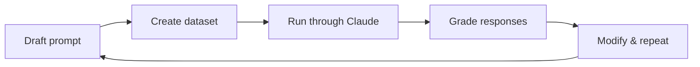

Prompt engineering without evaluation is guesswork. An eval pipeline gives you objective scores so you can compare prompt versions, catch regressions before they reach users. This page covers the full workflow: building test datasets, running evals, and grading with both code and model-based approaches.

## Why Evaluate Prompts

After writing a prompt, most engineers test it manually once or twice and ship. This fails in production because real users produce inputs you never anticipated.

Three approaches, in order of reliability:

1. **Test once, ship** --- fast, high risk. One manual check, no coverage of edge cases.
2. **Test a few times, tweak** --- moderate risk. Catches some issues but still misses the long tail.
3. **Run through an eval pipeline** --- highest reliability. Automated, objective, repeatable scoring across representative inputs.

Always choose option 3 for any prompt going to production. Evals catch regressions before users do.

## The Eval Workflow

Every eval pipeline follows five steps:



1. **Draft a prompt** with placeholder variables for test inputs
2. **Create an eval dataset** of representative inputs
3. **Feed each dataset item** through Claude using your prompt template
4. **Grade each response** using a code grader, model grader, or both
5. **Compute aggregate scores**, modify the prompt, and repeat

The average score across all dataset items is your objective metric for comparing prompt versions. A prompt with a higher average wins.

## Generating Test Datasets

Hand-crafting test cases is slow. Use Claude to generate them instead.

```python
import json
from anthropic import Anthropic

client = Anthropic()

def generate_dataset(task_description: str, count: int = 10) -> list[dict]:
    """Generate an eval dataset using Claude."""
    response = client.messages.create(
        model="claude-sonnet-4-20250514",
        max_tokens=4096,
        messages=[
            {
                "role": "user",
                "content": f"""Generate an evaluation dataset of {count} test cases.
Each test case is a JSON object with a "task" field describing a specific task.

Domain: {task_description}

Requirements:
- Include a mix of simple, complex, and edge-case inputs
- Each task should be self-contained
- Output a JSON array only, no other text

Example format:
[
  {{"task": "Description of task"}},
  {{"task": "Another task"}}
]"""
            },
            {
                "role": "assistant",
                "content": "[" # Prefill to get clean JSON
            }
        ],
        stop_sequences=["\n\n"]
    )
    return json.loads("[" + response.content[0].text)

# Generate and save
dataset = generate_dataset("Python functions for validating and sanitizing user input in a web application")
with open("dataset.json", "w") as f:
    json.dump(dataset, f, indent=2)

print(f"Generated {len(dataset)} test cases")
```

:::tip
Use a smaller, cheaper model like `claude-haiku-4-20250514` for dataset generation. Full quality is not needed for synthetic test data.
:::

Save your dataset to a file immediately after generation. This ensures consistent inputs across eval runs and avoids re-generating on every iteration.

## Running the Eval

The eval pipeline has three functions, each with a single responsibility:

```python
import json
from anthropic import Anthropic

client = Anthropic()

def run_prompt(test_case: dict, prompt_template: str) -> str:
    """Merge test case into prompt template and get Claude's response."""
    prompt = prompt_template.format(**test_case)
    response = client.messages.create(
        model="claude-sonnet-4-20250514",
        max_tokens=2048,
        messages=[{"role": "user", "content": prompt}]
    )
    return response.content[0].text

def run_test_case(test_case: dict, prompt_template: str) -> dict:
    """Run a single test case and grade the result."""
    output = run_prompt(test_case, prompt_template)
    model_score = grade_by_model(test_case, output)
    code_score = grade_by_code(output, test_case.get("format", "python"))

    return {
        "test_case": test_case,
        "output": output,
        "model_score": model_score["score"],
        "code_score": code_score,
        "reasoning": model_score["reasoning"]
    }

def run_eval(dataset: list[dict], prompt_template: str) -> list[dict]:
    """Run the full eval over a dataset and print aggregate scores."""
    results = []
    for test_case in dataset:
        result = run_test_case(test_case, prompt_template)
        results.append(result)

    avg_model = sum(r["model_score"] for r in results) / len(results)
    avg_code = sum(r["code_score"] for r in results) / len(results)
    print(f"Model grader avg: {avg_model:.1f}/10")
    print(f"Code grader avg:  {avg_code:.1f}/10")
    return results

# Load dataset and run
with open("dataset.json", "r") as f:
    dataset = json.load(f)

prompt_v1 = "Please solve the following task:\n\n{task}"
results = run_eval(dataset, prompt_v1)
```

Return structured result dicts (not just scores) so you can inspect output text alongside scores when debugging.

## Model-Based Grading

A model grader uses Claude as a judge to evaluate response quality. The key insight: ask for strengths, weaknesses, and reasoning *before* the score. Without this, scores cluster in the middle range.

```python
import json
from anthropic import Anthropic

client = Anthropic()

def grade_by_model(test_case: dict, output: str) -> dict:
    """Use Claude as a judge to score a response 1-10."""
    response = client.messages.create(
        model="claude-sonnet-4-20250514",
        max_tokens=1024,
        messages=[
            {
                "role": "user",
                "content": f"""You are an expert evaluator. Assess this AI-generated solution.

Task: {test_case['task']}
Solution: {output}

Respond with a JSON object containing:
- "strengths": array of 1-3 key strengths
- "weaknesses": array of 1-3 areas for improvement
- "reasoning": concise explanation of your assessment
- "score": number between 1 (poor) and 10 (excellent)"""
            },
            {
                "role": "assistant",
                "content": "```json\n"
            }
        ],
        stop_sequences=["```"]
    )
    return json.loads(response.content[0].text)
```

Model graders are best for subjective criteria: task following, helpfulness, completeness, safety. They add an API call per test case, so budget for the cost.

:::warning
Model graders are variable between runs. Individual scores may differ, but average trends across a full dataset are consistent for prompt comparison. Never draw conclusions from a single test case score.
:::

## Code-Based Grading

Code graders use programmatic checks for objective criteria: valid syntax, correct format, presence of required elements. They are deterministic and fast.

```python
import ast
import json
import re

def validate_python(text: str) -> int:
    """Return 10 if valid Python syntax, 0 otherwise."""
    try:
        ast.parse(text.strip())
        return 10
    except SyntaxError:
        return 0

def validate_json(text: str) -> int:
    """Return 10 if valid JSON, 0 otherwise."""
    try:
        json.loads(text.strip())
        return 10
    except json.JSONDecodeError:
        return 0

def validate_regex(text: str) -> int:
    """Return 10 if valid regex, 0 otherwise."""
    try:
        re.compile(text.strip())
        return 10
    except re.error:
        return 0

VALIDATORS = {
    "python": validate_python,
    "json": validate_json,
    "regex": validate_regex,
}

def grade_by_code(output: str, expected_format: str) -> int:
    """Route to the appropriate syntax validator."""
    validator = VALIDATORS.get(expected_format)
    if validator is None:
        return 10  # No code validation applicable
    return validator(output)
```

Code graders validate syntax, not correctness. `ast.parse()` confirms valid Python but cannot tell you whether the logic solves the right problem. Pair code graders with model graders for full coverage.

### Semantic Code Grading

Syntax validators check structure, but you often need to verify that generated code has the right *behavior*: correct function name, required patterns, no runtime errors.

```python
import ast
import subprocess
import tempfile

def grade_code_quality(
    output: str,
    expected_function: str,
    required_patterns: list[str] | None = None,
) -> dict:
    """Grade generated code on syntax, naming, patterns, and execution."""
    score = 0
    issues = []

    # 1. Valid syntax (3 points)
    try:
        tree = ast.parse(output.strip())
        score += 3
    except SyntaxError as e:
        return {"score": 0, "issues": [f"Syntax error: {e}"]}

    # 2. Expected function defined (3 points)
    func_names = [
        node.name for node in ast.walk(tree) if isinstance(node, ast.FunctionDef)
    ]
    if expected_function in func_names:
        score += 3
    else:
        issues.append(f"Expected function '{expected_function}', found: {func_names}")

    # 3. Required patterns present (2 points)
    if required_patterns:
        missing = [p for p in required_patterns if p not in output]
        if not missing:
            score += 2
        else:
            issues.append(f"Missing patterns: {missing}")

    # 4. Executes without error (2 points)
    with tempfile.NamedTemporaryFile(mode="w", suffix=".py", delete=False) as f:
        f.write(output.strip())
        f.flush()
        result = subprocess.run(
            ["python", f.name], capture_output=True, timeout=5
        )
    if result.returncode == 0:
        score += 2
    else:
        issues.append(f"Runtime error: {result.stderr.decode()[:200]}")

    return {"score": score, "issues": issues}
```

Use it in your eval pipeline with test cases that specify what the generated code should contain:

```python
test_cases = [
    {
        "task": "Write a function to validate and sanitize user email input for a web app",
        "expected_function": "sanitize_email",
        "required_patterns": ["strip()", "lower()"],
    },
    {
        "task": "Write a function to validate a webhook signature using HMAC-SHA256",
        "expected_function": "verify_webhook",
        "required_patterns": ["hmac", "sha256", "compare_digest"],
    },
]
```

## Combining Graders

The most effective eval pipelines use both grader types. A simple approach: average the two scores with equal weight.

```python
combined_score = (model_score + code_score) / 2
```

| Criterion | Grader type | What it checks |
| --- | --- | --- |
| Format compliance | Code | Output contains only the requested type |
| Valid syntax | Code | Generated code parses without errors |
| Task following | Model | Code solves the stated problem |
| Completeness | Model | Response covers all requirements |
| Code quality | Model | Clean, idiomatic, well-structured |

Adjust weights based on what matters most for your use case. For a code-generation prompt, you might weight syntax validation higher. For a writing task, model grading dominates.

## Iterating on Prompts

The entire point of eval is to drive prompt improvement. Change one variable at a time so score changes are attributable to your specific modification.

```python
# v1: baseline
prompt_v1 = "Please solve the following task:\n\n{task}"

# v2: add format constraint
prompt_v2 = """Solve the following task. Respond only with code, no explanation.

{task}"""

# v3: add format + quality instruction
prompt_v3 = """Solve the following task. Respond only with code, no explanation.
Write clean, well-structured code with meaningful variable names.

{task}"""

# Run all versions against the same dataset
for label, prompt in [("v1", prompt_v1), ("v2", prompt_v2), ("v3", prompt_v3)]:
    print(f"\n--- {label} ---")
    run_eval(dataset, prompt)
```

A prompt that scores higher on average across your dataset is better. This is empirical prompt development.

## Quick Reference

| Concept | Details |
| --- | --- |
| Eval dataset | JSON array of test case objects with representative inputs |
| Model grader | LLM-as-judge, best for subjective criteria (task following, quality) |
| Code grader | Programmatic validation, best for objective criteria (syntax, format) |
| Scoring | 1-10 scale, averaged across all dataset items |
| Iteration | Change one variable per prompt version, re-run full eval |
| Cost | Each test case = 1 generation call + 1 grading call (for model grader) |

## Related

- [Structured Output](/prompting/structured-output) --- enforce output format for cleaner grading
- [System Prompts](/prompting/system-prompts) --- use system prompts to set evaluation criteria
- [Models & Parameters](/the-api/models-and-parameters) --- choose models for generation vs. grading
- [Anthropic docs: Prompt evaluation](https://docs.anthropic.com/en/docs/build-with-claude/prompt-engineering/prompt-evaluation)
- [Anthropic Cookbook: Evaluation examples](https://github.com/anthropics/anthropic-cookbook/tree/main/misc/prompt_evaluation)
