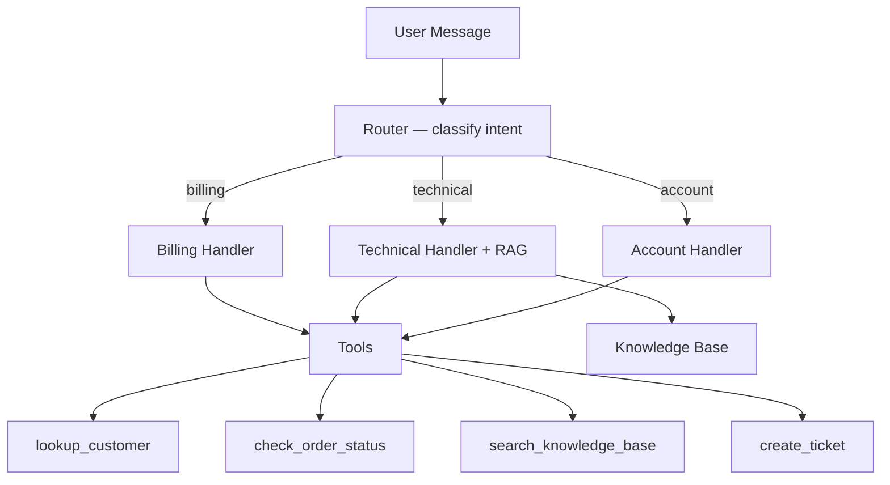

import Callout from '../../../components/Callout.astro';

This recipe combines patterns from across the guide — [routing](/agents/agent-architecture#routing), [RAG](/retrieval/rag), [tool use](/the-api/tool-use), [multi-turn conversations](/the-api/messages-api#multi-turn-conversations), [system prompts](/prompting/system-prompts), and [streaming](/the-api/streaming) — into a single working support agent. It handles billing, technical, and account questions by routing to specialized handlers backed by tools and a knowledge base.

## Architecture



The router classifies each message, then dispatches to a specialized handler with its own system prompt and tool set. The technical handler also searches a knowledge base for relevant help articles before responding.

## The Knowledge Base

A minimal vector search using sentence embeddings. In production, swap this for a proper vector database — the interface stays the same.

```python
import numpy as np

# Simulated help articles — in production, these come from your docs/wiki
HELP_ARTICLES = [
    {
        "id": "kb-001",
        "title": "How billing cycles work",
        "content": "Billing cycles run from the 1st to the last day of each month. "
        "Invoices are generated on the 1st and payment is due within 15 days. "
        "Mid-cycle plan changes are prorated based on remaining days.",
    },
    {
        "id": "kb-002",
        "title": "Troubleshooting API 500 errors",
        "content": "If you receive 500 errors from the API: 1) Check the status page "
        "at status.example.com. 2) Verify your request payload matches the schema. "
        "3) Retry with exponential backoff (1s, 2s, 4s). 4) If errors persist for "
        "more than 5 minutes, contact support with your request ID.",
    },
    {
        "id": "kb-003",
        "title": "Upgrading or downgrading your plan",
        "content": "Plan changes take effect immediately. Upgrades are prorated for the "
        "remaining billing period. Downgrades take effect at the next billing cycle. "
        "Enterprise plan changes require contacting your account manager.",
    },
    {
        "id": "kb-004",
        "title": "Rate limit guidelines",
        "content": "Rate limits depend on your plan: Free (100 req/min), Growth (1,000 "
        "req/min), Enterprise (10,000 req/min). When rate limited, you'll receive a "
        "429 response with a Retry-After header. Implement exponential backoff.",
    },
]


def search_knowledge_base(query: str, top_k: int = 2) -> list[dict]:
    """Keyword search over help articles. Replace with vector search in production."""
    query_terms = set(query.lower().split())
    scored = []
    for article in HELP_ARTICLES:
        text = f"{article['title']} {article['content']}".lower()
        score = sum(1 for term in query_terms if term in text)
        if score > 0:
            scored.append((score, article))
    scored.sort(key=lambda x: x[0], reverse=True)
    return [a for _, a in scored[:top_k]]
```

<Callout type="tip">
For a production knowledge base, see [What is RAG](/retrieval/rag) for the full pipeline and [Chunking Strategies](/retrieval/chunking-strategies) for preparing your documents.
</Callout>

## The Tools

Four tools cover the support domain: customer lookup, order status, knowledge search, and ticket creation.

```python
import json
from datetime import datetime

# Simulated data stores
CUSTOMERS = {
    "alice@acme.com": {"name": "Alice Chen", "plan": "enterprise", "mrr": 2400, "status": "active"},
    "bob@startup.io": {"name": "Bob Park", "plan": "growth", "mrr": 199, "status": "active"},
}

ORDERS = {
    "ORD-9901": {"customer": "alice@acme.com", "status": "shipped", "total": 4800, "tracking": "1Z999AA10123"},
    "ORD-9902": {"customer": "bob@startup.io", "status": "processing", "total": 199, "tracking": None},
}

TICKETS: list[dict] = []


def lookup_customer(email: str) -> dict:
    if email not in CUSTOMERS:
        raise ValueError(f"No customer found with email: {email}")
    return {"email": email, **CUSTOMERS[email]}


def check_order_status(order_id: str) -> dict:
    if order_id not in ORDERS:
        raise ValueError(f"Order {order_id} not found")
    return {"order_id": order_id, **ORDERS[order_id]}


def create_ticket(customer_email: str, subject: str, priority: str = "medium") -> dict:
    ticket = {
        "ticket_id": f"TKT-{len(TICKETS) + 1001}",
        "customer": customer_email,
        "subject": subject,
        "priority": priority,
        "status": "open",
        "created_at": datetime.now().isoformat(),
    }
    TICKETS.append(ticket)
    return ticket


# Tool schemas for the Claude API
TOOL_SCHEMAS = [
    {
        "name": "lookup_customer",
        "description": "Look up a customer by email. Returns name, plan, MRR, and status.",
        "input_schema": {
            "type": "object",
            "properties": {
                "email": {"type": "string", "description": "Customer email address"}
            },
            "required": ["email"],
        },
    },
    {
        "name": "check_order_status",
        "description": "Check the status of an order by order ID. Returns status, total, and tracking number.",
        "input_schema": {
            "type": "object",
            "properties": {
                "order_id": {"type": "string", "description": "Order ID, e.g. ORD-9901"}
            },
            "required": ["order_id"],
        },
    },
    {
        "name": "search_knowledge_base",
        "description": "Search help articles for relevant documentation. Use when the customer has a technical question or you need to reference official guidance.",
        "input_schema": {
            "type": "object",
            "properties": {
                "query": {"type": "string", "description": "Search query describing the topic"}
            },
            "required": ["query"],
        },
    },
    {
        "name": "create_ticket",
        "description": "Create a support ticket for issues that need follow-up. Use after gathering enough context from the customer.",
        "input_schema": {
            "type": "object",
            "properties": {
                "customer_email": {"type": "string", "description": "Customer email"},
                "subject": {"type": "string", "description": "Brief description of the issue"},
                "priority": {"type": "string", "enum": ["low", "medium", "high", "critical"]},
            },
            "required": ["customer_email", "subject"],
        },
    },
]

TOOL_DISPATCH = {
    "lookup_customer": lambda args: lookup_customer(**args),
    "check_order_status": lambda args: check_order_status(**args),
    "search_knowledge_base": lambda args: search_knowledge_base(**args),
    "create_ticket": lambda args: create_ticket(**args),
}
```

## The Router

A lightweight classification call decides which handler processes the message. This is the [routing pattern](/agents/agent-architecture#routing) — a cheap first call that selects a specialized pipeline.

```python
import anthropic

client = anthropic.Anthropic()

CATEGORIES = ["billing", "technical", "account"]

HANDLER_PROMPTS = {
    "billing": (
        "You are a billing support specialist. Help customers with invoices, charges, "
        "payment issues, and plan pricing. Be precise about amounts and dates. "
        "Look up the customer's account before answering billing questions."
    ),
    "technical": (
        "You are a technical support engineer. Diagnose issues methodically. "
        "Always search the knowledge base for relevant articles before answering. "
        "Provide step-by-step solutions with specific commands or settings."
    ),
    "account": (
        "You are an account manager. Help with plan changes, upgrades, downgrades, "
        "cancellations, and account settings. Look up the customer's current plan "
        "before suggesting changes."
    ),
}


def classify(message: str) -> str:
    """Route a message to billing, technical, or account."""
    response = client.messages.create(
        model="claude-haiku-4-5-20251001",
        max_tokens=20,
        system=(
            "Classify the support message into exactly one category: "
            "billing, technical, or account. Reply with only the category name."
        ),
        messages=[{"role": "user", "content": message}],
    )
    category = response.content[0].text.strip().lower()
    return category if category in CATEGORIES else "technical"
```

<Callout type="info">
The router uses Haiku for speed and cost — classification doesn't require a large model. The specialized handlers use Sonnet for quality. This is a common pattern: [cheap model for routing, capable model for generation](/the-api/models-and-parameters).
</Callout>

## The Agent Loop

The loop ties everything together: route the message, set the right system prompt, then run the standard [agentic tool loop](/the-api/tool-use#the-agentic-loop) with streaming.

```python
def run_agent(user_message: str, conversation: list[dict] | None = None) -> str:
    """Run the support agent for a single user turn."""
    if conversation is None:
        conversation = []

    # Route to the right handler
    category = classify(user_message)
    system_prompt = HANDLER_PROMPTS[category]

    # Add the user message to conversation history
    conversation.append({"role": "user", "content": user_message})

    max_iterations = 10
    for _ in range(max_iterations):
        response = client.messages.create(
            model="claude-sonnet-4-20250514",
            max_tokens=1024,
            system=system_prompt,
            tools=TOOL_SCHEMAS,
            messages=conversation,
        )

        # Append the full assistant response
        conversation.append({"role": "assistant", "content": response.content})

        # If Claude is done, extract and return text
        if response.stop_reason != "tool_use":
            return "".join(b.text for b in response.content if b.type == "text")

        # Execute all tool calls
        tool_results = []
        for block in response.content:
            if block.type == "tool_use":
                handler = TOOL_DISPATCH.get(block.name)
                if handler:
                    try:
                        result = handler(block.input)
                        tool_results.append({
                            "type": "tool_result",
                            "tool_use_id": block.id,
                            "content": json.dumps(result, default=str),
                        })
                    except Exception as e:
                        tool_results.append({
                            "type": "tool_result",
                            "tool_use_id": block.id,
                            "content": str(e),
                            "is_error": True,
                        })

        conversation.append({"role": "user", "content": tool_results})

    return "Handing off to a human agent."
```

## Full Runnable Script

Set `ANTHROPIC_API_KEY` in your environment and run it.

```python
#!/usr/bin/env python3
"""Support agent combining routing, RAG, tool use, and multi-turn conversation."""

import json
from datetime import datetime
import anthropic

client = anthropic.Anthropic()

# --- Knowledge Base ---
HELP_ARTICLES = [
    {"id": "kb-001", "title": "How billing cycles work",
     "content": "Billing cycles run from the 1st to the last day of each month. Invoices are generated on the 1st and payment is due within 15 days. Mid-cycle plan changes are prorated."},
    {"id": "kb-002", "title": "Troubleshooting API 500 errors",
     "content": "If you receive 500 errors: 1) Check status.example.com. 2) Verify your request payload. 3) Retry with exponential backoff. 4) If errors persist 5+ minutes, contact support with your request ID."},
    {"id": "kb-003", "title": "Upgrading or downgrading your plan",
     "content": "Upgrades are prorated immediately. Downgrades take effect next billing cycle. Enterprise changes require your account manager."},
    {"id": "kb-004", "title": "Rate limit guidelines",
     "content": "Limits by plan: Free (100 req/min), Growth (1,000 req/min), Enterprise (10,000 req/min). 429 responses include a Retry-After header."},
]

def search_knowledge_base(query: str, top_k: int = 2) -> list[dict]:
    query_terms = set(query.lower().split())
    scored = []
    for article in HELP_ARTICLES:
        text = f"{article['title']} {article['content']}".lower()
        score = sum(1 for term in query_terms if term in text)
        if score > 0:
            scored.append((score, article))
    scored.sort(key=lambda x: x[0], reverse=True)
    return [a for _, a in scored[:top_k]]

# --- Data Stores ---
CUSTOMERS = {
    "alice@acme.com": {"name": "Alice Chen", "plan": "enterprise", "mrr": 2400, "status": "active"},
    "bob@startup.io": {"name": "Bob Park", "plan": "growth", "mrr": 199, "status": "active"},
}
ORDERS = {
    "ORD-9901": {"customer": "alice@acme.com", "status": "shipped", "total": 4800, "tracking": "1Z999AA10123"},
    "ORD-9902": {"customer": "bob@startup.io", "status": "processing", "total": 199, "tracking": None},
}
TICKETS: list[dict] = []

def lookup_customer(email: str) -> dict:
    if email not in CUSTOMERS:
        raise ValueError(f"No customer found with email: {email}")
    return {"email": email, **CUSTOMERS[email]}

def check_order_status(order_id: str) -> dict:
    if order_id not in ORDERS:
        raise ValueError(f"Order {order_id} not found")
    return {"order_id": order_id, **ORDERS[order_id]}

def create_ticket(customer_email: str, subject: str, priority: str = "medium") -> dict:
    ticket = {"ticket_id": f"TKT-{len(TICKETS) + 1001}", "customer": customer_email,
              "subject": subject, "priority": priority, "status": "open",
              "created_at": datetime.now().isoformat()}
    TICKETS.append(ticket)
    return ticket

# --- Tool Schemas ---
TOOL_SCHEMAS = [
    {"name": "lookup_customer", "description": "Look up a customer by email. Returns name, plan, MRR, and status.",
     "input_schema": {"type": "object", "properties": {"email": {"type": "string"}}, "required": ["email"]}},
    {"name": "check_order_status", "description": "Check order status by ID. Returns status, total, and tracking.",
     "input_schema": {"type": "object", "properties": {"order_id": {"type": "string"}}, "required": ["order_id"]}},
    {"name": "search_knowledge_base", "description": "Search help articles for relevant documentation.",
     "input_schema": {"type": "object", "properties": {"query": {"type": "string"}}, "required": ["query"]}},
    {"name": "create_ticket", "description": "Create a support ticket for issues needing follow-up.",
     "input_schema": {"type": "object", "properties": {"customer_email": {"type": "string"}, "subject": {"type": "string"},
                       "priority": {"type": "string", "enum": ["low", "medium", "high", "critical"]}},
                       "required": ["customer_email", "subject"]}},
]
TOOL_DISPATCH = {
    "lookup_customer": lambda args: lookup_customer(**args),
    "check_order_status": lambda args: check_order_status(**args),
    "search_knowledge_base": lambda args: search_knowledge_base(**args),
    "create_ticket": lambda args: create_ticket(**args),
}

# --- Router ---
CATEGORIES = ["billing", "technical", "account"]
HANDLER_PROMPTS = {
    "billing": "You are a billing support specialist. Be precise about amounts and dates. Look up the customer before answering.",
    "technical": "You are a technical support engineer. Search the knowledge base before answering. Give step-by-step solutions.",
    "account": "You are an account manager. Look up the customer's current plan before suggesting changes.",
}

def classify(message: str) -> str:
    response = client.messages.create(
        model="claude-haiku-4-5-20251001", max_tokens=20,
        system="Classify into exactly one category: billing, technical, or account. Reply with only the category.",
        messages=[{"role": "user", "content": message}],
    )
    category = response.content[0].text.strip().lower()
    return category if category in CATEGORIES else "technical"

# --- Agent Loop ---
def run_agent(user_message: str, conversation: list[dict] | None = None) -> str:
    if conversation is None:
        conversation = []
    category = classify(user_message)
    conversation.append({"role": "user", "content": user_message})

    for _ in range(10):
        response = client.messages.create(
            model="claude-sonnet-4-20250514", max_tokens=1024,
            system=HANDLER_PROMPTS[category], tools=TOOL_SCHEMAS, messages=conversation,
        )
        conversation.append({"role": "assistant", "content": response.content})

        if response.stop_reason != "tool_use":
            return "".join(b.text for b in response.content if b.type == "text")

        tool_results = []
        for block in response.content:
            if block.type == "tool_use":
                try:
                    result = TOOL_DISPATCH[block.name](block.input)
                    tool_results.append({"type": "tool_result", "tool_use_id": block.id,
                                         "content": json.dumps(result, default=str)})
                except Exception as e:
                    tool_results.append({"type": "tool_result", "tool_use_id": block.id,
                                         "content": str(e), "is_error": True})
        conversation.append({"role": "user", "content": tool_results})

    return "Handing off to a human agent."

# --- Demo ---
if __name__ == "__main__":
    conversation = []
    print("Support Agent (type 'quit' to exit)\n")
    while True:
        user_input = input("You: ").strip()
        if user_input.lower() in ("quit", "exit", "q"):
            break
        response = run_agent(user_input, conversation)
        print(f"\nAgent: {response}\n")
```

## Try It

```bash
export ANTHROPIC_API_KEY="your-key-here"
python support_agent.py
```

Example conversation:

```
You: Alice Chen reported a billing error on her March invoice. Her email is alice@acme.com.
Agent: [looks up alice@acme.com, searches KB for billing cycles, creates a ticket]

You: Can you also check the status of her order ORD-9901?
Agent: [checks order status, reports shipped with tracking number]
```

## Patterns Used

| Pattern | Where | Dedicated page |
| --- | --- | --- |
| Routing | `classify()` dispatches to specialized handlers | [Agent Architecture — Routing](/agents/agent-architecture#routing) |
| RAG | `search_knowledge_base()` retrieves help articles | [What is RAG](/retrieval/rag) |
| Tool use | Four tools with agentic loop | [Tool Use](/the-api/tool-use) |
| Multi-turn | `conversation` list persists across turns | [Messages API](/the-api/messages-api#multi-turn-conversations) |
| System prompts | Per-handler system prompts | [System Prompts](/prompting/system-prompts) |
| Model tiering | Haiku for routing, Sonnet for generation | [Models & Parameters](/the-api/models-and-parameters) |

## Related

- [Agent Architecture](/agents/agent-architecture) — workflows, agentic loops, and orchestration patterns
- [Orchestration Patterns](/agents/orchestration) — deeper dive on routing and chaining
- [Tool Use](/the-api/tool-use) — the mechanics of tool definitions and the agentic loop
- [What is RAG](/retrieval/rag) — full RAG pipeline with vector search
- [Build a Chatbot](/recipes/build-chatbot) — simpler multi-turn recipe without tools
