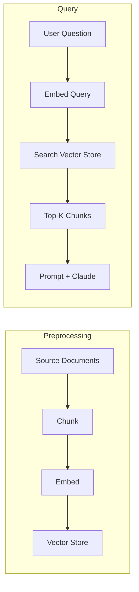

RAG lets Claude answer questions about documents too large to fit in a single prompt. Instead of stuffing everything into context, you break documents into chunks, index them with embeddings, and retrieve only the relevant pieces at query time. The result: lower cost, lower latency, and the ability to work with arbitrarily large document collections.

## When to Use RAG

The naive approach — paste the whole document into the prompt — works fine for small documents. It breaks down when you hit:

- **Context limits** — documents exceed the model's maximum prompt length
- **Performance degradation** — very long prompts reduce answer quality even before hitting hard limits
- **Cost** — you pay per input token; sending 800 pages when you need 2 paragraphs is wasteful
- **Latency** — more tokens in, longer time to first token out

RAG trades upfront engineering complexity for scalability and efficiency. If your documents are small enough to fit in context with good results, skip RAG.

## Architecture Overview

RAG has two phases: a preprocessing pipeline (run once per document) and a query pipeline (run per user question).



Steps 1-3 happen ahead of time. Steps 4-6 happen per query.

## A Simple RAG Pipeline

Here's the full flow — preprocess a document, then answer questions against it:

```python
import anthropic
import voyageai
from dotenv import load_dotenv

load_dotenv()

anthropic_client = anthropic.Anthropic()
voyage_client = voyageai.Client()

# --- Preprocessing ---

with open("report.md") as f:
    text = f.read()

# Simple size-based chunking (see Chunking Strategies for alternatives)
def chunk_by_size(text: str, chunk_size: int = 800, overlap: int = 100) -> list[str]:
    chunks = []
    start = 0
    while start < len(text):
        end = min(start + chunk_size, len(text))
        chunks.append(text[start:end])
        start = end - overlap if end < len(text) else len(text)
    return chunks

chunks = chunk_by_size(text)

embeddings = voyage_client.embed(
    chunks, model="voyage-3-large", input_type="document"
).embeddings

# In-memory store (use a vector database in production)
import numpy as np

store = [(np.array(emb), chunk) for emb, chunk in zip(embeddings, chunks)]

# --- Query ---

def ask(question: str, k: int = 3) -> str:
    # Embed the question
    query_emb = np.array(voyage_client.embed(
        [question], model="voyage-3-large", input_type="query"
    ).embeddings[0])

    # Retrieve top-k chunks by cosine similarity
    scored = []
    for emb, chunk in store:
        sim = np.dot(query_emb, emb) / (np.linalg.norm(query_emb) * np.linalg.norm(emb))
        scored.append((chunk, sim))
    scored.sort(key=lambda x: x[1], reverse=True)
    context = "\n\n---\n\n".join(chunk for chunk, _ in scored[:k])

    # Generate answer
    response = anthropic_client.messages.create(
        model="claude-sonnet-4-20250514",
        max_tokens=1024,
        messages=[{
            "role": "user",
            "content": f"""Answer the question using only the provided context.

<context>
{context}
</context>

<question>
{question}
</question>""",
        }],
    )
    return response.content[0].text

answer = ask("What did the software engineering department accomplish last year?")
print(answer)
```

## Quick Reference

| Component | Recommendation |
| --- | --- |
| Chunking default | Size-based, 500-1000 chars, 50-100 overlap |
| Embedding model | `voyage-3-large` via VoyageAI |
| Embedding input_type | `"document"` for chunks, `"query"` for questions |
| Similarity metric | Cosine similarity |
| Retrieval k | Start with 3-5, tune based on answer quality |
| Search method | Hybrid (vector + BM25) for production |

## Related

- [Chunking Strategies](/retrieval/chunking-strategies) — choose the right chunking approach for your content
- [Embeddings & Vector Search](/retrieval/embeddings-and-search) — embedding models, vector databases, and hybrid retrieval
- [Tool Use](/the-api/tool-use) — give Claude tools to query your RAG pipeline dynamically
- [System Prompts](/prompting/system-prompts) — craft the generation prompt for RAG responses
- [Evaluation](/prompting/evaluation) — measure RAG retrieval and answer quality
- [Anthropic RAG cookbook](https://github.com/anthropics/anthropic-cookbook/tree/main/misc/retrieval_augmented_generation)
