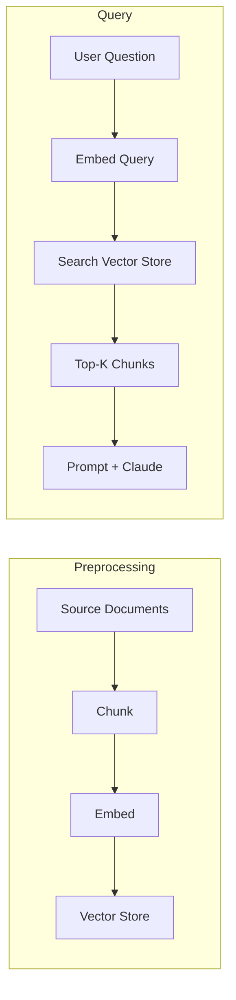

RAG lets Claude answer questions about documents too large to fit in a single prompt. Instead of stuffing everything into context, you break documents into chunks, index them with embeddings, and retrieve only the relevant pieces at query time. The result: lower cost, lower latency, and the ability to work with arbitrarily large document collections.

## When to Use RAG

The naive approach — paste the whole document into the prompt — works fine for small documents. It breaks down when you hit:

- **Context limits** — documents exceed the model's maximum prompt length
- **Performance degradation** — very long prompts reduce answer quality even before hitting hard limits
- **Cost** — you pay per input token; sending 800 pages when you need 2 paragraphs is wasteful
- **Latency** — more tokens in, longer time to first token out

RAG trades upfront engineering complexity for scalability and efficiency. If your documents are small enough to fit in context with good results, skip RAG.

## Architecture Overview

RAG has two phases: a preprocessing pipeline (run once per document) and a query pipeline (run per user question).



Steps 1-3 happen ahead of time. Steps 4-6 happen per query.

## Chunking Strategies

Chunking strategy directly determines retrieval quality. Bad chunks cause wrong answers even with a perfect retrieval system.

### Size-Based Chunking

Split text into fixed-length segments with overlap to avoid cutting words mid-sentence:

```python
def chunk_by_size(text: str, chunk_size: int = 500, overlap: int = 50) -> list[str]:
    chunks = []
    start = 0
    while start < len(text):
        end = min(start + chunk_size, len(text))
        chunks.append(text[start:end])
        start = end - overlap if end < len(text) else len(text)
    return chunks
```

Simple, reliable, works with any content type including code. The overlap prevents losing context at chunk boundaries.

### Sentence-Based Chunking

Split on sentence boundaries, then group sentences into chunks:

```python
import re

def chunk_by_sentence(
    text: str,
    max_sentences: int = 5,
    overlap_sentences: int = 1,
) -> list[str]:
    sentences = re.split(r"(?<=[.!?])\s+", text)
    chunks = []
    start = 0

    while start < len(sentences):
        end = min(start + max_sentences, len(sentences))
        chunks.append(" ".join(sentences[start:end]))
        start += max_sentences - overlap_sentences

    return chunks
```

Better preservation of meaning than size-based, but the regex may not handle all edge cases (abbreviations, decimal numbers).

### Structure-Based Chunking

Split on document structure when the format is predictable:

```python
import re

def chunk_by_section(text: str) -> list[str]:
    return re.split(r"\n## ", text)
```

Highest quality when it works, but only viable when you control the document format (Markdown, HTML with consistent headers).

### Choosing a Strategy

| Strategy | Best For | Trade-off |
| --- | --- | --- |
| Size-based + overlap | Code, mixed content, unknown formats | May split semantic units |
| Sentence-based | Prose, articles, reports | Regex edge cases |
| Structure-based | Markdown, HTML with headers | Requires predictable format |
| Semantic | Research papers, multi-topic docs | Computationally expensive |

Size-based with overlap is the most common production default because it works everywhere with no assumptions about document structure.

:::tip
Chunk size directly affects retrieval quality. Chunks that are too large dilute relevance; chunks that are too small lose context. Start with 500-1000 characters and tune based on your retrieval accuracy.
:::

## Embeddings

After chunking, you need to convert text to numerical vectors for similarity search. Each embedding is a list of floating-point numbers that captures the semantic meaning of the text.

Anthropic does not provide an embeddings API. Use a third-party provider like VoyageAI:

```python
import voyageai
from dotenv import load_dotenv

load_dotenv()  # reads VOYAGE_API_KEY from .env

voyage_client = voyageai.Client()

def generate_embeddings(
    texts: str | list[str],
    model: str = "voyage-3-large",
    input_type: str = "document",
) -> list[list[float]]:
    if isinstance(texts, str):
        texts = [texts]
    result = voyage_client.embed(texts, model=model, input_type=input_type)
    return result.embeddings
```

Set `input_type="document"` when embedding chunks, and `input_type="query"` when embedding user questions. This asymmetry improves retrieval accuracy.

:::warning
Switching embedding models requires re-embedding all your chunks. Different models produce vectors of different dimensions that are not compatible with each other.
:::

## Vector Search

Store embeddings in a vector database and use cosine similarity to find the chunks closest to the user's query:

```python
import numpy as np

class VectorStore:
    def __init__(self):
        self.embeddings: list[np.ndarray] = []
        self.documents: list[dict] = []

    def add(self, embedding: list[float], metadata: dict):
        self.embeddings.append(np.array(embedding))
        self.documents.append(metadata)

    def search(self, query_embedding: list[float], k: int = 3) -> list[tuple[dict, float]]:
        query = np.array(query_embedding)
        scores = []
        for i, emb in enumerate(self.embeddings):
            similarity = np.dot(query, emb) / (np.linalg.norm(query) * np.linalg.norm(emb))
            scores.append((self.documents[i], similarity))
        scores.sort(key=lambda x: x[1], reverse=True)
        return scores[:k]
```

Cosine similarity ranges from -1 (opposite) to 1 (identical). Higher is better. Production systems use purpose-built vector databases (Pinecone, Weaviate, pgvector) instead of in-memory stores, but the interface is the same: store vectors with metadata, search by similarity.

## The Full Pipeline

Putting it all together — preprocess documents, then answer questions:

```python
import anthropic
import voyageai
from dotenv import load_dotenv

load_dotenv()

anthropic_client = anthropic.Anthropic()
voyage_client = voyageai.Client()

# --- Preprocessing ---

with open("report.md") as f:
    text = f.read()

chunks = chunk_by_size(text, chunk_size=800, overlap=100)

embeddings = voyage_client.embed(
    chunks, model="voyage-3-large", input_type="document"
).embeddings

store = VectorStore()
for chunk, embedding in zip(chunks, embeddings):
    store.add(embedding, {"content": chunk})

# --- Query ---

def ask(question: str, k: int = 3) -> str:
    # Embed the question
    query_emb = voyage_client.embed(
        [question], model="voyage-3-large", input_type="query"
    ).embeddings[0]

    # Retrieve top-k chunks
    results = store.search(query_emb, k=k)
    context = "\n\n---\n\n".join(doc["content"] for doc, _ in results)

    # Generate answer
    response = anthropic_client.messages.create(
        model="claude-sonnet-4-20250514",
        max_tokens=1024,
        messages=[{
            "role": "user",
            "content": f"""Answer the question using only the provided context.

<context>
{context}
</context>

<question>
{question}
</question>""",
        }],
    )
    return response.content[0].text

answer = ask("What did the software engineering department accomplish last year?")
print(answer)
```

## BM25 Lexical Search

Semantic search finds conceptually similar text but can miss exact term matches. A query for incident ID `INC-2023-Q4-011` may retrieve conceptually related cybersecurity content instead of the paragraph containing that exact ID.

BM25 (Best Match 25) is a lexical search algorithm that scores documents by term frequency weighted by rarity. Common words like "the" get low weight; rare terms like incident IDs get high weight.

```python
from rank_bm25 import BM25Okapi

class BM25Index:
    def __init__(self):
        self.documents: list[dict] = []
        self.corpus: list[list[str]] = []
        self.bm25 = None

    def add_document(self, document: dict):
        self.documents.append(document)
        self.corpus.append(document["content"].lower().split())
        self.bm25 = BM25Okapi(self.corpus)

    def search(self, query: str, k: int = 3) -> list[tuple[dict, float]]:
        tokens = query.lower().split()
        scores = self.bm25.get_scores(tokens)
        top_indices = scores.argsort()[-k:][::-1]
        return [(self.documents[i], scores[i]) for i in top_indices]
```

| Search Type | Excels At | Weak At |
| --- | --- | --- |
| Semantic (vector) | Synonyms, paraphrasing, conceptual similarity | Exact IDs, technical terms, specific phrases |
| Lexical (BM25) | Exact matches, IDs, technical terms | Synonyms, conceptual similarity |

## Hybrid Retrieval

Production RAG systems combine both search methods and merge results with Reciprocal Rank Fusion (RRF):

```python
def reciprocal_rank_fusion(
    result_lists: list[list[tuple[dict, float]]],
    k: int = 60,
) -> list[tuple[dict, float]]:
    """Merge ranked results from multiple search methods."""
    scores: dict[int, float] = {}
    doc_map: dict[int, dict] = {}

    for results in result_lists:
        for rank, (doc, _) in enumerate(results):
            doc_id = id(doc)
            doc_map[doc_id] = doc
            scores[doc_id] = scores.get(doc_id, 0) + 1 / (k + rank + 1)

    sorted_ids = sorted(scores, key=scores.get, reverse=True)
    return [(doc_map[did], scores[did]) for did in sorted_ids]

# Usage
vector_results = vector_store.search(query_embedding, k=5)
bm25_results = bm25_index.search(query_text, k=5)
merged = reciprocal_rank_fusion([vector_results, bm25_results])
```

RRF normalizes across scoring scales — vector search returns cosine similarity while BM25 returns term frequency scores. By using rank positions instead of raw scores, RRF merges them fairly. Documents that rank highly in both systems rise to the top.

The architecture is extensible. Any search index that returns ranked results can be added as another input to the fusion function — keyword-based, graph-based, or domain-specific indexes all plug in the same way.

## Quick Reference

| Component | Recommendation |
| --- | --- |
| Chunking default | Size-based, 500-1000 chars, 50-100 overlap |
| Embedding model | `voyage-3-large` via VoyageAI |
| Embedding input_type | `"document"` for chunks, `"query"` for questions |
| Similarity metric | Cosine similarity |
| Retrieval k | Start with 3-5, tune based on answer quality |
| Search method | Hybrid (vector + BM25) for production |
| RRF constant (k) | 60 (standard default) |

## Related

- [Tool Use](/the-api/tool-use) — give Claude tools to query your RAG pipeline dynamically
- [System Prompts](/prompting/system-prompts) — craft the generation prompt for RAG responses
- [Structured Output](/prompting/structured-output) — extract structured data from retrieved chunks
- [Cost Optimization](/production/cost-optimization) — RAG reduces per-query token cost
- [Evaluation](/prompting/evaluation) — measure RAG retrieval and answer quality
- [Anthropic RAG cookbook](https://github.com/anthropics/anthropic-cookbook/tree/main/misc/retrieval_augmented_generation)
- [VoyageAI docs](https://docs.voyageai.com/)
