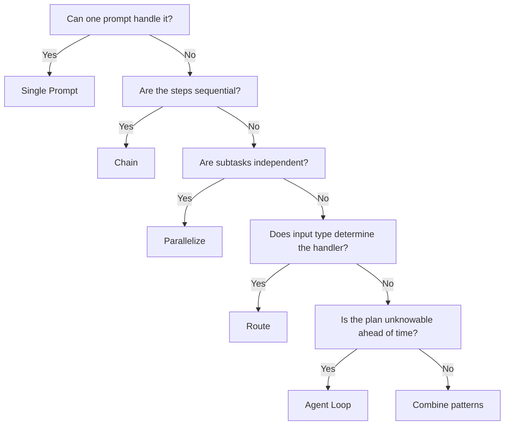

You've picked your platform ([API, Claude Code, or Agent SDK](/start-here/choose-your-path)). Now pick the right pattern. Most over-engineering happens here — teams reach for agents when a chain would do, or build RAG when the document fits in a single prompt.

This page covers three decisions:
1. **How complex should my system be?** (complexity ladder)
2. **How do I give Claude the right knowledge?** (knowledge strategy)
3. **How do I connect Claude to external services?** (integration strategy)

## Complexity Ladder

Start simple. Add complexity only when the simpler approach fails.

| Pattern | What it is | Use when | Example |
| --- | --- | --- | --- |
| **Single prompt** | One API call | Task is self-contained | Summarize an email |
| **[Chain](/agents/orchestration)** | Sequential Claude calls, each builds on the last | Steps have a natural order | Draft → revise → format |
| **[Parallelize](/agents/orchestration)** | Independent subtasks run concurrently | Subtasks don't depend on each other | Grade an essay on 3 rubrics simultaneously |
| **[Route](/agents/orchestration)** | Classify input, then dispatch to a specialized handler | Different input types need different treatment | Support tickets: billing vs. technical vs. general |
| **[Agent loop](/agents/agent-architecture)** | Claude gets tools and decides its own plan | You can't predetermine the steps | "Research this topic and write a report" |

:::tip
Default to the simplest pattern that works. A chain of 3 focused prompts will outperform a general-purpose agent on most structured tasks — and it's far easier to test, debug, and maintain.
:::

## Knowledge Strategy

How you give Claude information depends on how much you have and how often it changes.

| Strategy | How it works | Use when | Tradeoff |
| --- | --- | --- | --- |
| **Direct context** | Paste content into the prompt | Document fits in the context window with room for the answer | Simplest. No infrastructure. Cost scales with document size. |
| **[RAG](/retrieval/rag)** | Chunk, embed, retrieve relevant pieces | Documents are too large for context, or you have many documents | Better cost/latency at scale. Requires preprocessing pipeline. |
| **Tool-based retrieval** | Give Claude a search [tool](/the-api/tool-use) and let it query on demand | Data is live, dynamic, or requires structured queries (SQL, APIs) | Most flexible. Claude decides what to search for. Higher latency per retrieval. |

**Decision shortcut:**
- **< 50 pages** of static content → try direct context first. Claude's 200K token window is large.
- **50+ pages** or growing corpus → [RAG](/retrieval/rag). Preprocess once, retrieve per query.
- **Live data** (databases, APIs, dashboards) → tool-based retrieval. RAG can't index what changes every minute.

You can combine strategies. A common production pattern: RAG for your documentation corpus + a tool for live database queries.

## Integration Strategy

When Claude needs to call external services, you have two paths.

| Approach | How it works | Use when |
| --- | --- | --- |
| **[Direct tool definitions](/the-api/tool-use)** | Define tools inline in your API call with JSON schemas | Tools are specific to your app, few in number, tightly coupled to your logic |
| **[MCP](/mcp/mcp)** | Connect to MCP servers that expose tools via a standard protocol | Tools are reusable across projects, shared with a team, or available as pre-built servers (GitHub, databases, etc.) |

**Decision shortcut:**
- Building **one app** with **a few custom tools** → define them directly. Less moving parts.
- Tools should be **reusable**, **shared across projects**, or you want to use the **pre-built MCP ecosystem** → MCP. One server wraps a service; any client can use it.
- Need **both** → start with direct tools, extract to MCP servers when you find yourself duplicating tool definitions across projects.

## Combining Strategies

Real applications mix patterns. Here's how common use cases map:

| Use case | Complexity | Knowledge | Integration |
| --- | --- | --- | --- |
| Customer support bot | Route by ticket type → chain per type | RAG over help docs | Direct tools for ticket system |
| Code review assistant | Single prompt | Direct context (the diff) | None |
| Research agent | Agent loop | Tool-based retrieval | MCP for web search + databases |
| Document Q&A | Single prompt or chain | RAG | None |
| Data pipeline | Chain | Direct context | Direct tools for database + APIs |

## Related

- [Choose Your Path](/start-here/choose-your-path) — API vs Claude Code vs Agent SDK
- [Agent Architecture](/agents/agent-architecture) — workflows vs agents deep dive
- [Orchestration Patterns](/agents/orchestration) — chaining, routing, parallelization
- [What is RAG](/retrieval/rag) — retrieval pipeline overview
- [Tool Use](/the-api/tool-use) — giving Claude tools
- [MCP](/mcp/mcp) — the standard protocol for tool integration
