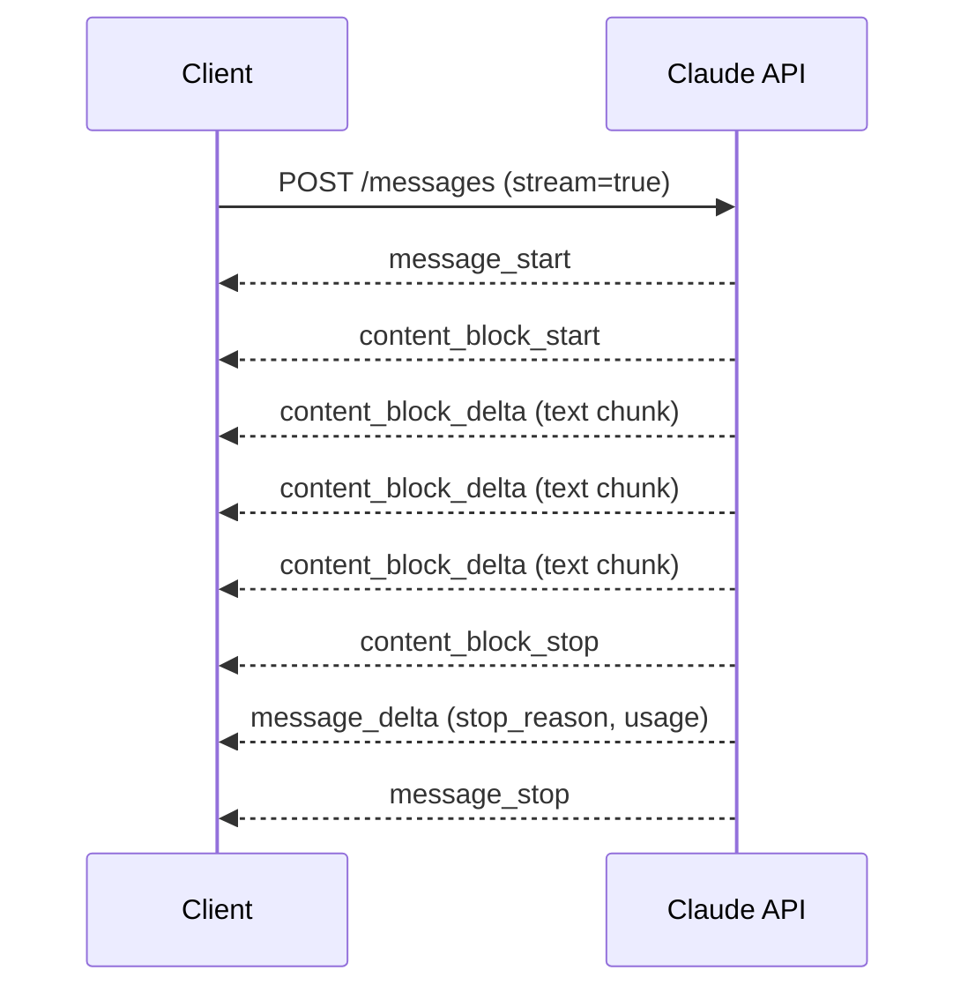

Without streaming, the API waits for Claude to generate the entire response before returning anything. For long responses, that means 10-30 seconds of dead silence. Streaming sends text chunks as they're generated, so users see words appearing in real time. This page covers both streaming interfaces, the event model, and when to use streaming.

## The Simple Interface

The Python SDK provides `client.messages.stream()` with a `text_stream` iterator that yields only the generated text — no event filtering needed.

```python
from anthropic import Anthropic

client = Anthropic()

with client.messages.stream(
    model="claude-sonnet-4-20250514",
    max_tokens=1024,
    messages=[{"role": "user", "content": "Explain how TCP/IP works in 4 paragraphs."}]
) as stream:
    for text in stream.text_stream:
        print(text, end="", flush=True)
```

After the stream completes, retrieve the full response object for storage or multi-turn history:

```python
with client.messages.stream(
    model="claude-sonnet-4-20250514",
    max_tokens=1024,
    messages=[{"role": "user", "content": "Explain how TCP/IP works in 4 paragraphs."}]
) as stream:
    for text in stream.text_stream:
        print(text, end="", flush=True)

    # Complete message object — same as a non-streaming response
    final_message = stream.get_final_message()
    print(f"\nTokens used: {final_message.usage.input_tokens + final_message.usage.output_tokens}")
```

In TypeScript, the equivalent uses `.stream()` with an `on("text")` handler:

```typescript
import Anthropic from "@anthropic-ai/sdk";

const client = new Anthropic();

const stream = client.messages
  .stream({
    model: "claude-sonnet-4-20250514",
    max_tokens: 1024,
    messages: [{ role: "user", content: "Explain how TCP/IP works in 4 paragraphs." }]
  })
  .on("text", (text) => {
    process.stdout.write(text);
  });

const message = await stream.finalMessage();
```

:::tip
For [multi-turn conversations](/the-api/messages-api#multi-turn-conversations), call `stream.get_final_message()` (Python) or `stream.finalMessage()` (TypeScript) after streaming completes and append the result to your messages list. The assembled text is identical to what a non-streaming call returns.
:::

## Raw Event Streaming

For lower-level control, use `stream=True` on `messages.create()`. This yields raw Server-Sent Events (SSE) that you filter yourself.

```python
from anthropic import Anthropic

client = Anthropic()

stream = client.messages.create(
    model="claude-sonnet-4-20250514",
    max_tokens=1024,
    messages=[{"role": "user", "content": "Write a haiku about APIs."}],
    stream=True,
)

for event in stream:
    if event.type == "content_block_delta" and event.delta.type == "text_delta":
        print(event.delta.text, end="", flush=True)
```

### Event Types

The stream emits six event types in order:

| Event | Purpose |
| --- | --- |
| `message_start` | Opening event with message metadata |
| `content_block_start` | Marks the beginning of a content block |
| `content_block_delta` | Carries generated text chunks — this is what you display |
| `content_block_stop` | Marks the end of a content block |
| `message_delta` | Final metadata update (includes `stop_reason`, output token count) |
| `message_stop` | Stream complete |

Only `content_block_delta` events contain displayable text. The rest are structural.



## Async Streaming

For async Python applications:

```python
import asyncio
from anthropic import AsyncAnthropic

client = AsyncAnthropic()

async def stream_response():
    async with client.messages.stream(
        model="claude-sonnet-4-20250514",
        max_tokens=1024,
        messages=[{"role": "user", "content": "Explain async/await in Python."}]
    ) as stream:
        async for text in stream.text_stream:
            print(text, end="", flush=True)

        message = await stream.get_final_message()
        return message

asyncio.run(stream_response())
```

## When to Use Streaming

**Use streaming when:**
- Building a chat UI — perceived latency drops from seconds to near-instant
- Generating long-form content where users watch output appear
- Forwarding responses through a WebSocket or SSE connection to a browser

**Skip streaming when:**
- Processing responses programmatically (parsing JSON, extracting data) — wait for the complete response instead
- Running batch operations where latency per request doesn't matter
- The response will be very short (a classification label, a yes/no)

:::warning
Streaming requires managing a context manager (`with` block in Python). The stream is an HTTP connection that must be properly closed. Always use `with` or `async with` — don't iterate raw streams without cleanup.
:::

## Quick Reference

| Approach | Python | TypeScript |
| --- | --- | --- |
| Simple text stream | `client.messages.stream()` + `text_stream` | `client.messages.stream()` + `.on("text")` |
| Raw events | `messages.create(stream=True)` | `messages.create({ stream: true })` |
| Get final message | `stream.get_final_message()` | `await stream.finalMessage()` |

## Related

- [Messages API](/the-api/messages-api) — request structure and non-streaming responses
- [Structured Output](/prompting/structured-output) — parsing structured data from responses
- [Error Handling](/production/error-handling) — retry strategies for failed streams
- [Anthropic streaming documentation](https://docs.anthropic.com/en/api/streaming)
