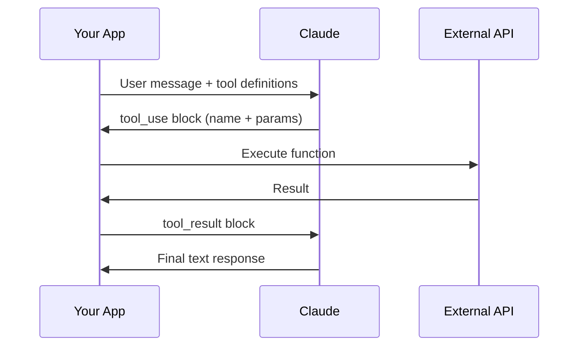

Tool use lets Claude request that your application execute functions on its behalf — fetching live data, calling APIs, writing files, or anything else your code can do. Claude decides *when* to use a tool and *what parameters* to pass. Your code handles execution and returns results.

## How Tool Use Works

The protocol is a four-step loop:



1. You send a message and a list of tool definitions
2. Claude returns a `tool_use` block requesting a specific function with parameters
3. Your code executes the function and collects the result
4. You send the result back as a `tool_result` block — Claude incorporates it into its response

Claude never executes tools directly. It only produces structured requests that your application fulfills.

## Defining Tools

Each tool needs two things: a function that does the work, and a JSON schema that tells Claude what the tool does and what arguments it accepts.

### The Function

Keep tool functions simple, single-purpose, and validated:

```python
from datetime import datetime

def get_current_datetime(date_format: str = "%Y-%m-%d %H:%M:%S") -> str:
    if not date_format:
        raise ValueError("date_format cannot be empty")
    return datetime.now().strftime(date_format)
```

Clear error messages matter — Claude can see them and retry with corrected parameters.

### The Schema

The schema has three top-level fields: `name`, `description`, and `input_schema`. The `description` is the most important part — it tells Claude when to use the tool and what it returns.

```python
get_current_datetime_tool = {
    "name": "get_current_datetime",
    "description": (
        "Returns the current date and time formatted according to the "
        "specified format string. Use this when the user asks about the "
        "current date or time. Returns a formatted datetime string."
    ),
    "input_schema": {
        "type": "object",
        "properties": {
            "date_format": {
                "type": "string",
                "description": "Python strftime format string. Defaults to '%Y-%m-%d %H:%M:%S'."
            }
        },
        "required": []
    }
}
```

Write 3-4 sentences in the description covering: what the tool does, when to use it, what it returns, and argument details. Vague descriptions lead to Claude misusing or ignoring the tool.

:::tip
Use Claude itself to generate schemas — paste your function signature and the [tool use docs](https://docs.anthropic.com/en/docs/agents-and-tools/tool-use/overview) and ask it to write the JSON schema.
:::

## Handling the Response

When Claude uses a tool, the response contains multiple content blocks instead of a single text block. You need to handle both types:

```python
import anthropic
import json

client = anthropic.Anthropic()

messages = [{"role": "user", "content": "What time is it right now?"}]

response = client.messages.create(
    model="claude-sonnet-4-20250514",
    max_tokens=1024,
    tools=[get_current_datetime_tool],
    messages=messages,
)

# response.content may contain:
# [TextBlock(text="Let me check..."), ToolUseBlock(id="toolu_xxx", name="get_current_datetime", input={"date_format": "%H:%M:%S"})]
```

The `ToolUseBlock` contains an `id` (for matching results), `name` (which function to call), and `input` (a dict of parameters).

## Sending Tool Results

After executing the tool, send the result back in a `tool_result` block:

```python
# 1. Append the full assistant response (all blocks, not just text)
messages.append({"role": "assistant", "content": response.content})

# 2. Find and execute the tool
tool_block = next(b for b in response.content if b.type == "tool_use")
result = get_current_datetime(**tool_block.input)

# 3. Send the result back
messages.append({
    "role": "user",
    "content": [{
        "type": "tool_result",
        "tool_use_id": tool_block.id,
        "content": json.dumps(result),
    }]
})

# 4. Get Claude's final response
final = client.messages.create(
    model="claude-sonnet-4-20250514",
    max_tokens=1024,
    tools=[get_current_datetime_tool],
    messages=messages,
)
print(final.content[0].text)
```

Key rules:
- The `tool_use_id` must exactly match the `id` from the `ToolUseBlock`
- Serialize tool output as a string with `json.dumps()`
- Tool results go in a `user` role message, not `assistant`
- Include the `tools` parameter on every API call in the conversation, even when you don't expect another tool call

:::warning
Always append `response.content` in its entirety to message history. If you strip tool_use blocks and only keep text, subsequent API calls will fail. This is the most common tool use bug.
:::

## The Agentic Loop

When a user request requires multiple tools in sequence, Claude will keep requesting tools until it has enough information to respond. Your code needs a loop that continues until Claude stops asking for tools:

```python
import anthropic
import json

client = anthropic.Anthropic()

tools = [get_current_datetime_tool, get_weather_tool]  # your tool schemas

def run_tool(name: str, tool_input: dict):
    """Route tool calls to implementations."""
    if name == "get_current_datetime":
        return get_current_datetime(**tool_input)
    elif name == "get_weather":
        return get_weather(**tool_input)
    else:
        raise ValueError(f"Unknown tool: {name}")

def run_conversation(user_message: str) -> str:
    messages = [{"role": "user", "content": user_message}]

    while True:
        response = client.messages.create(
            model="claude-sonnet-4-20250514",
            max_tokens=1024,
            tools=tools,
            messages=messages,
        )
        messages.append({"role": "assistant", "content": response.content})

        # Exit when Claude is done using tools
        if response.stop_reason != "tool_use":
            break

        # Process all tool requests in this response
        tool_results = []
        for block in response.content:
            if block.type == "tool_use":
                try:
                    output = run_tool(block.name, block.input)
                    tool_results.append({
                        "type": "tool_result",
                        "tool_use_id": block.id,
                        "content": json.dumps(output),
                    })
                except Exception as e:
                    tool_results.append({
                        "type": "tool_result",
                        "tool_use_id": block.id,
                        "content": str(e),
                        "is_error": True,
                    })

        messages.append({"role": "user", "content": tool_results})

    # Extract text from the final response
    return "\n".join(b.text for b in response.content if b.type == "text")
```

The critical details:
- **Loop condition**: `response.stop_reason == "tool_use"` means Claude wants another tool call. Any other stop reason means it has a final answer.
- **Error handling**: Always send a `tool_result` back, even on errors. Set `is_error: True` so Claude knows the call failed and can retry or explain the failure.
- **Multiple tool calls**: Claude can request multiple tools in a single response. Process all of them and send all results together in one user message.
- **Tool routing**: A dispatcher function maps tool names to implementations, keeping conversation logic clean.

## Working with Multiple Tools

Adding a new tool follows a consistent four-step pattern:

1. Write the function
2. Define its JSON schema
3. Add the schema to the `tools` list
4. Add a branch to your tool router

All schemas are passed together in every API call — Claude sees every available tool and decides which (if any) to use.

## Built-in Tools

Claude provides two built-in tools that don't require custom schema definitions.

### Web Search

The web search tool is fully managed — Claude handles the entire search execution. You only provide a configuration stub:

```python
import anthropic

client = anthropic.Anthropic()

response = client.messages.create(
    model="claude-sonnet-4-20250514",
    max_tokens=1024,
    tools=[{
        "type": "web_search_20250305",
        "name": "web_search",
        "max_uses": 5,
    }],
    messages=[{"role": "user", "content": "What happened in tech news today?"}],
)
```

Use `allowed_domains` to restrict results to authoritative sources:

```python
{
    "type": "web_search_20250305",
    "name": "web_search",
    "max_uses": 5,
    "allowed_domains": ["reuters.com", "apnews.com"],
}
```

Web search responses include `ServerToolUseBlock`, `WebSearchToolResultBlock`, and citation blocks with source URLs and quoted text.

### Text Editor

The text editor tool (`str_replace_editor`) lets Claude view files, replace text, create files, and insert content at specific lines. Unlike web search, you must implement the execution functions — Claude only knows the interface.

```python
# The schema stub is model-specific
text_editor_tool = {
    "type": "text_editor_20250429",
    "name": "str_replace_editor",
}
```

The `type` value is version-specific and changes with new model releases. Always check the [text editor tool docs](https://docs.anthropic.com/en/docs/agents-and-tools/tool-use/text-editor-tool) for the current value.

## Streaming with Tools

When streaming a tool-enabled response, you'll encounter `InputJsonEvent` chunks as Claude generates tool arguments:

```python
with client.messages.stream(
    model="claude-sonnet-4-20250514",
    max_tokens=1024,
    tools=tools,
    messages=messages,
) as stream:
    for event in stream:
        if event.type == "input_json":
            print(event.partial_json)  # incremental chunk
            # event.snapshot has cumulative JSON so far
```

By default, the API buffers tool argument chunks until a complete key-value pair is validated against the schema. This causes delays followed by bursts — expected behavior, not a bug. For character-level streaming of tool arguments (lower latency, but you must handle potentially invalid JSON), see the [streaming docs](https://docs.anthropic.com/en/docs/resources/streaming).

## Quick Reference

| Concept | Details |
| --- | --- |
| Tool schema fields | `name`, `description`, `input_schema` |
| Stop reason for tool calls | `response.stop_reason == "tool_use"` |
| Tool result role | `user` (not `assistant`) |
| ID matching | `tool_use_id` in result must match `id` in `ToolUseBlock` |
| Web search type | `web_search_20250305` |
| Text editor type | `text_editor_20250429` |
| Tool choice options | `auto` (default), `any`, `{"type": "tool", "name": "..."}` |

## Related

- [Messages API](/the-api/messages-api) — the underlying API that tool use builds on
- [Streaming](/the-api/streaming) — streaming responses including tool use events
- [Structured Output](/prompting/structured-output) — using tools to force JSON output
- [Agent Architecture](/agents/agent-architecture) — building agents from agentic tool loops
- [MCP](/mcp/mcp) — standardized tool protocol for interoperable tools
- [Anthropic tool use docs](https://docs.anthropic.com/en/docs/agents-and-tools/tool-use/overview)
- [Text editor tool docs](https://docs.anthropic.com/en/docs/agents-and-tools/tool-use/text-editor-tool)
- [Web search tool docs](https://docs.anthropic.com/en/docs/agents-and-tools/tool-use/web-search-tool)
